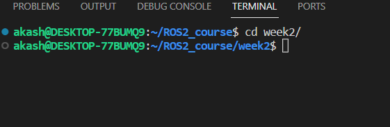
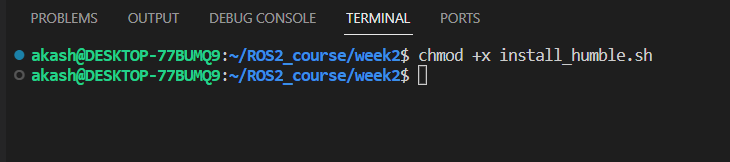
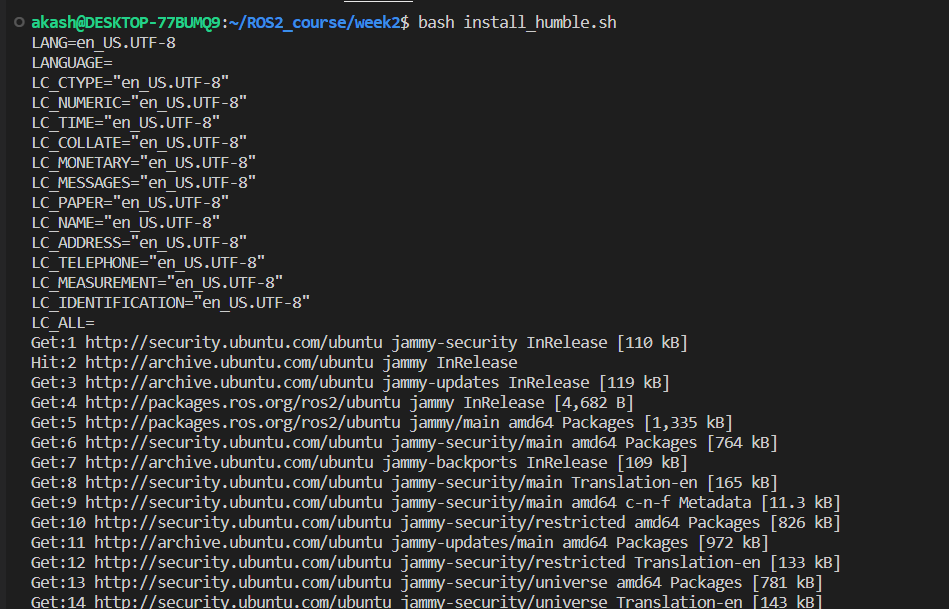
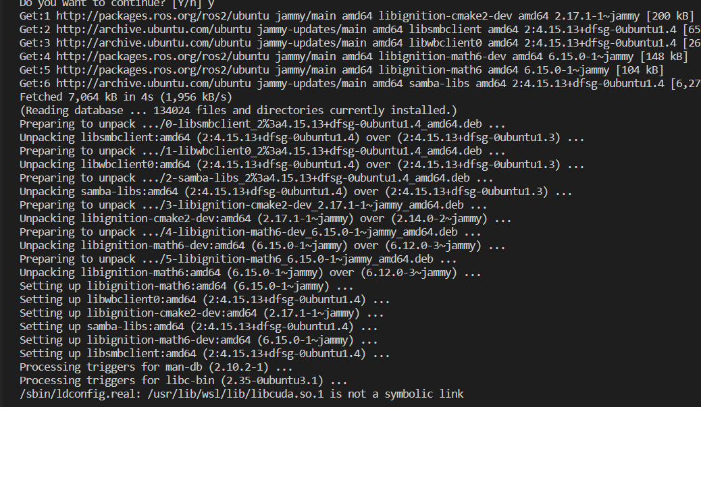
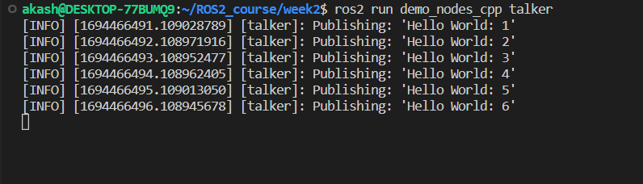

# Creating shell script to automate ros2-humble installation

1. Clone the directory

2. Change directory to week2
> cd week2

3. Make sure the shell script is executible
> chmod +x install_humble.sh

4. Test the installtion by using the command
> bash install_humble.sh

5. Wait for installation to be completed.

6. Test the ROS2 with `Talked-listener` example. 

