# Begineer: cli commands 

## Using `turtlesim`, `ros2`, and `rqt`

### Installing: turtlesim and rqt using bash file

1. Change the bash file to executable, to do this run:
> sudo chmod 777 -R .

2. After this, execute the bash file:
> ./install_turtlesim_rqt.bash


### About Turtlesim
Turtlesim is a lightweight simulator for learning ROS 2. It illustrates what ROS 2 does at the most basic level to give you an idea of what you will do with a real robot or a robot simulation later on.

1. Verify if the package is installed or not
> ros2 pkg executables turtlesim
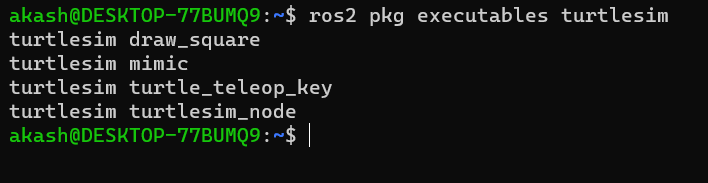

2. Start turtlesim
> ros2 run turtlesim turtlesim_node

The above command will open a simulator window.


3. Use turtlesim
In order to use turtlesim, we need to open a new node to control it:
> ros2 run turtlesim turtle_teleop_key

A new terminal will open, and you can use the arrow button to control the turtlebot in the simulator.
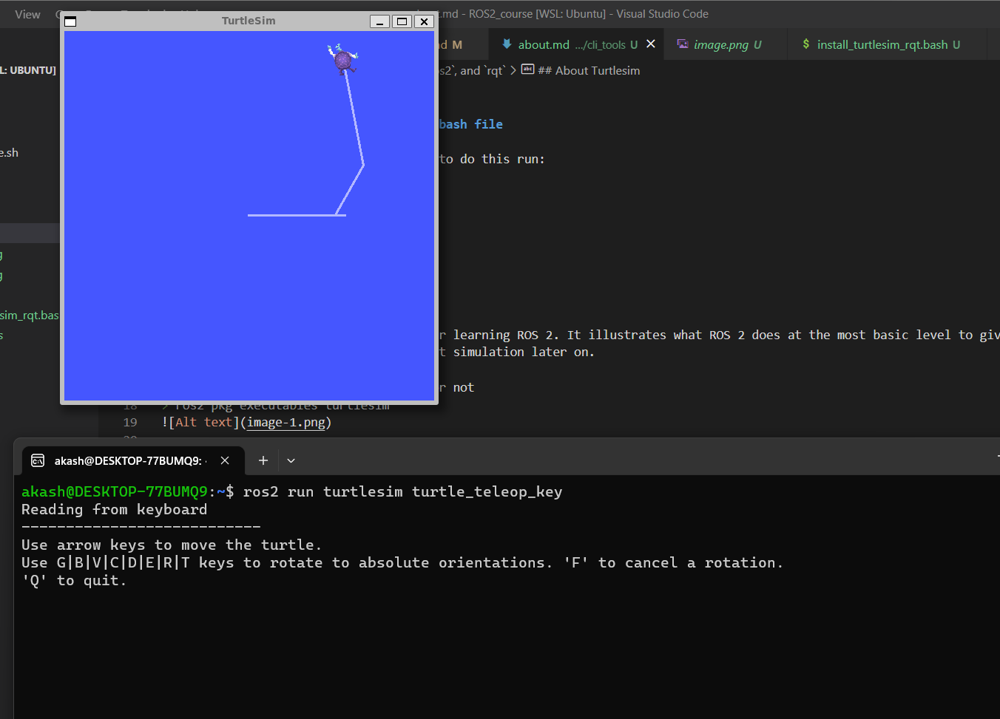

4. Using `ros2` tools such as: `ros2 node list`,  `ros2 topic list`, `ros2 service list`, `ros2 action list`,
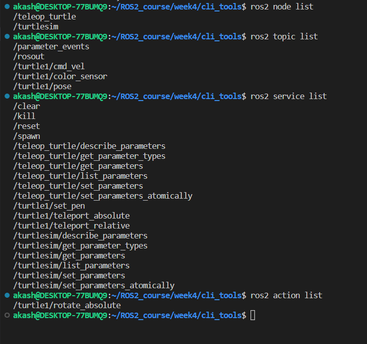

### About rqt
rqt is GUI tools for ROS2. It provides a user-friendly way to manipulate ROS2 elements. *Note: Everything that can be done using rqt can also be done using the command line.*

1. Opening rqt
> rqt

For the first time, the window will appear as blank. Just select `Plugins > Services > Service Caller` from the menu bar at the top.
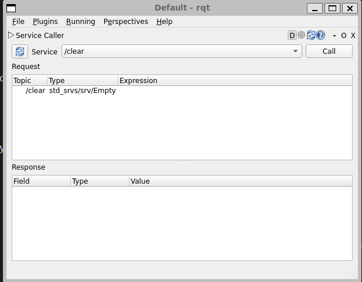

2. Try the spawn service
From the list option, select /spawn. This will create another turtle in the turtlesim.
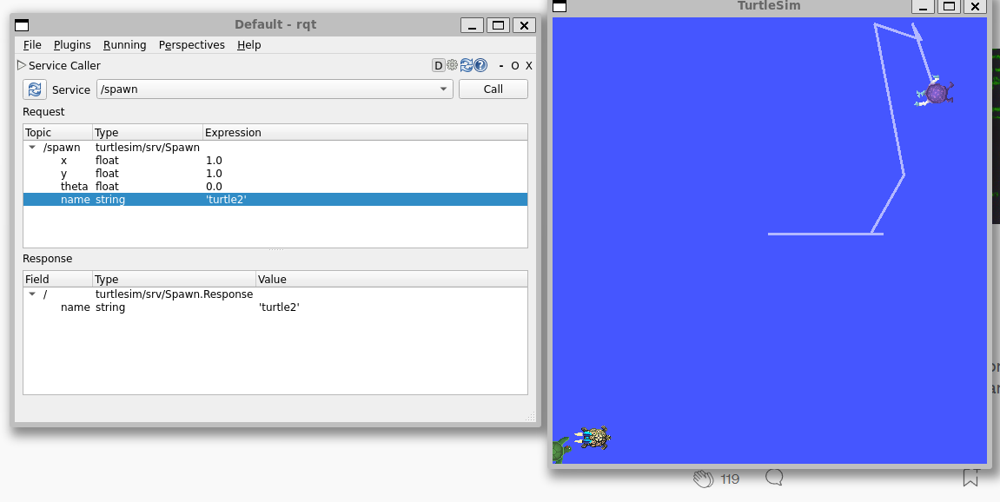

Now, when you `refresh`, then you can see the `turtle2` service as well.

3. Try the set_pen service
We will change the color of the line and its width to 'red' and '5', respectively.
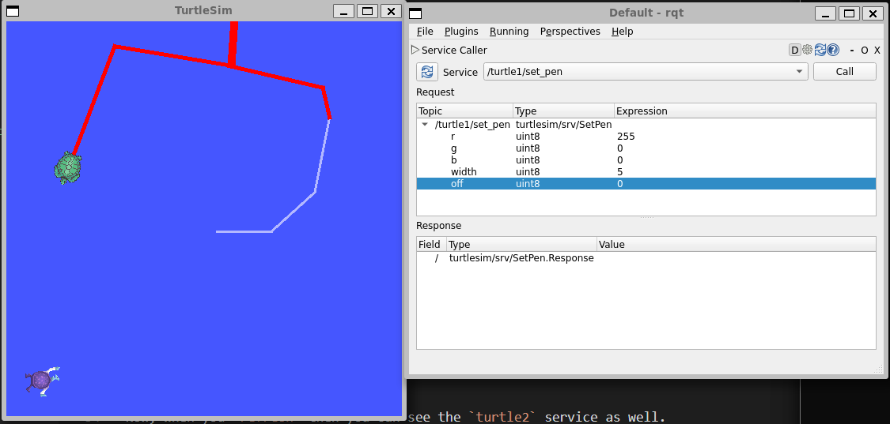


## Understanding nodes

We will learn about the function of nodes in `ROS2`, and the tools to interact with them. 

### Ros2 Graph
 ROS graph is a network of ROS2 elements processing data together at the same time.

 ## Nodes
 Nod is a standalone process that performs a specific task or set of tasks within robotics system.  Node can communicate `one to one`, or `one to many`, or `many to one` , or `many to many` .  ROS node communicate each other via `topics, actions or parameters.`

 ``Some important ros2 command``
### ros2 run

 ***launches an executable from a package.***

 > ros2 run package_name executable_name
 
package name:   refers to the name of the ROS 2 package that contains the executable  you want to run.

executable_name:  refers to the name of the executable binary (or script) you want to run.
  


 For example in our previous turtlesim, we use 

 > ros2 run turtlesim turtlesim_node

Here, ``turtlesim`` is `package name` and `turtlesim_node`  is `executable_node`

### ros2 node list

***This will show the list of all runing nodes***

Example, i run two node: a) ros2 run turtlesim turtlesim_node , and b) ros2 run turtlesim turtle_teleop_key. 

After running, ros2 node list: 

/teleop_turtle <br>
/turtlesim

### Remapping
`Remapping`: allos to reassign default name properties, like node name, topic name

We will change the node name of `turtlesim_node` to   `turtle_akash`
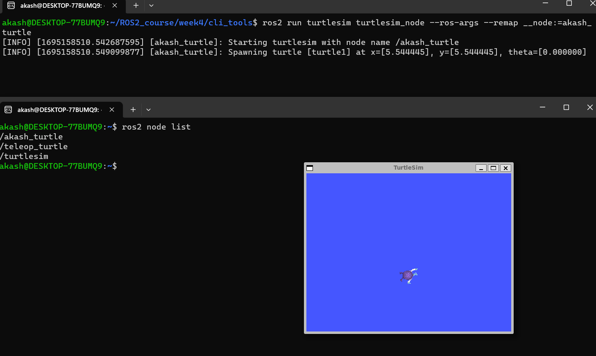

### ros2 node info
 to access the information of particular node

 > ros2 node info /`node_name`

 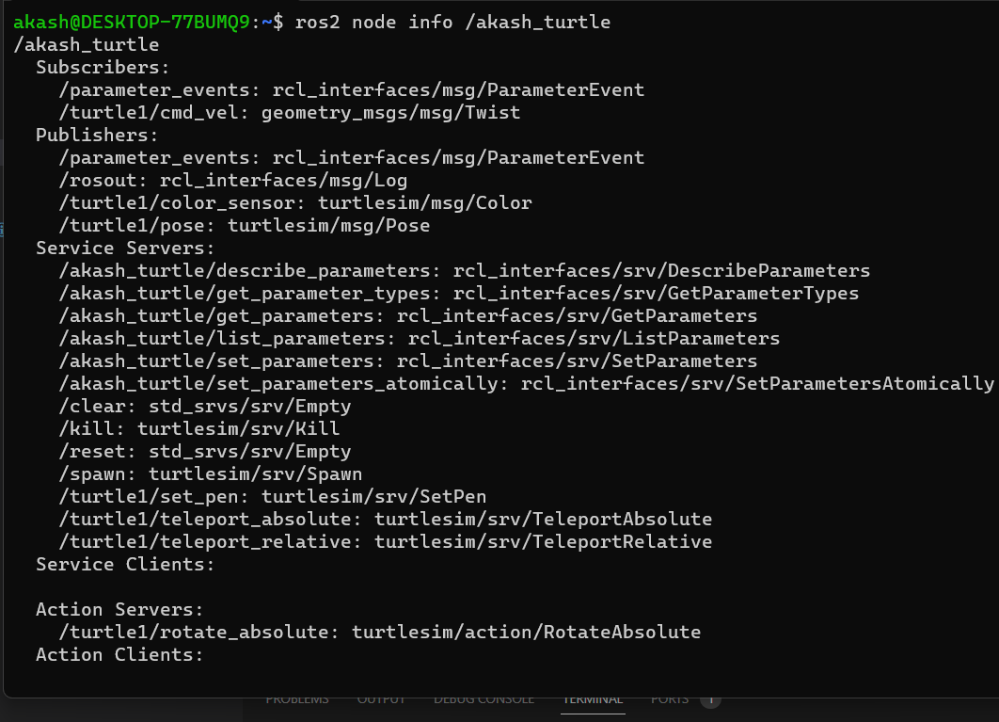

 ## ros2 topics

 `topics` is one of the way ros2 node communicate with each other.  
 
-  communication via `topics` can be   `one to one`, or `one to many`, or `many to one` , or `many to many` .  ROS node communicate each other via `topics, actions or parameters.`

- Node who send `message` via `topics` are called `publisher.`
- Node who receive `message` via `topics` are called `subscriber.`
- `message`: specific data type on which topics communicate.  They are defined by ``.msg``  file for custom messge.  The data includes information coming from the sensors. 

### Task 

Open two terminal and run : `ros2 run turtlesim turtlesim_node` , and ``ros2 run turtlesim turtle_teleop_key``. 

From previous steps we know the nodes name: `/turtlesim` and `/teleop_turtle`

### rqt_graph

Ros2 rqt provides `rqt_graph`; this tool can be used to visualize communication of node via topics. 

1. run ``rqt_graph`` 

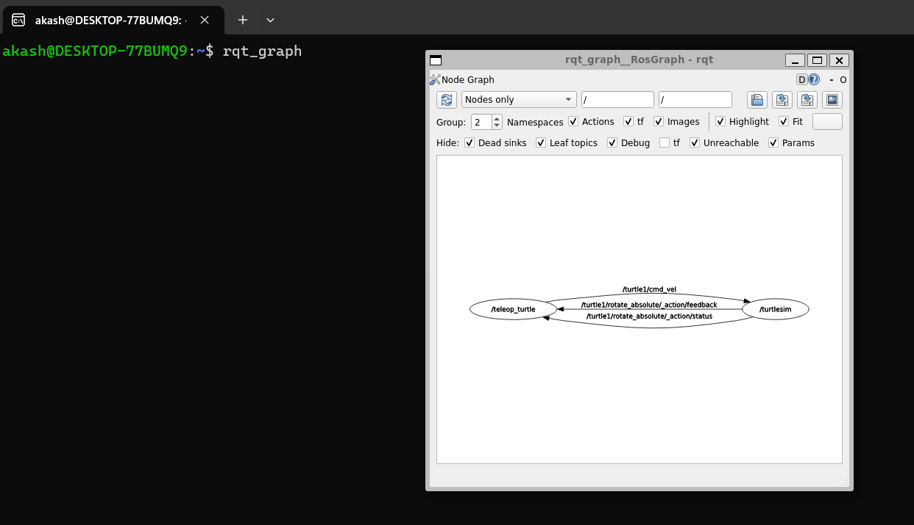

We can see how `/turtlesim` and `/teleop_turtle` are communicating. We can see that,  `/teleop_turtle` uses  topic name `/turtle1/cmd_val` to publish keystroke you press on command line; and the message is received by publisher `/turtlesim` node.

2. ros2 topic list
> command: ros2 topic list
: returns the lish of all active topics

In order to return the topic list with topic type use the following command:
> ros2 topic list -t

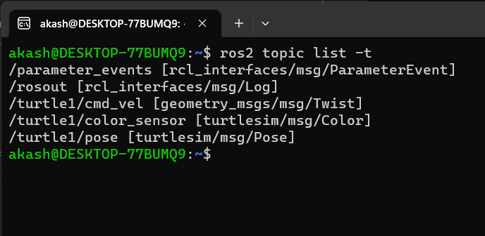

*Note: uncheck all boxes under Hide to visualise all the topics*
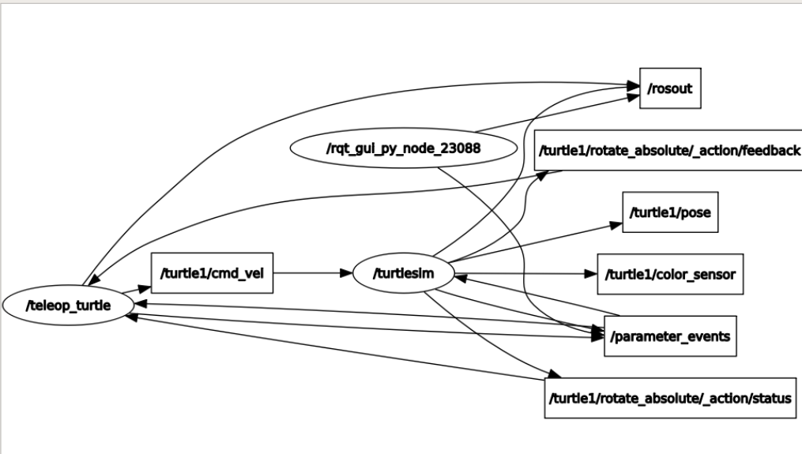

### ros2 topic echo 
: to know what data is being published by topic
> command: ros2 topic echo *topic name*

We know from above topic name `/turtle1/cmd_val` to publish keystroke you press on command line; and the message is received by publisher `/turtlesim` node.

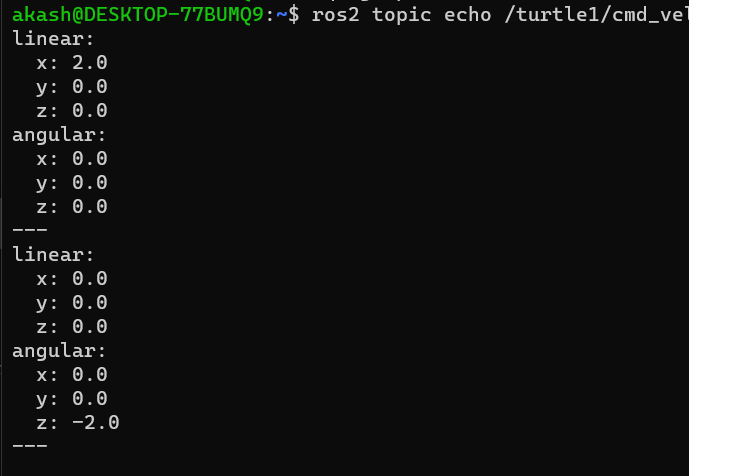

Form the above image, you can see whenever you press key then `x`, `y`,`z` is being publish via topic `/turtle1/cmd_val`

run `rqt_graph` again

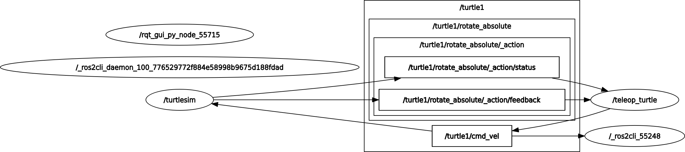

In above diagram, `/_ros2cli_26646` is created by ros2 echo. 

### ros2 topic info
: returns information of running certain topic

> command: ros2 topic info *topic name*
 
 `ros2 topic info /turtle1/cmd_vel` return:
 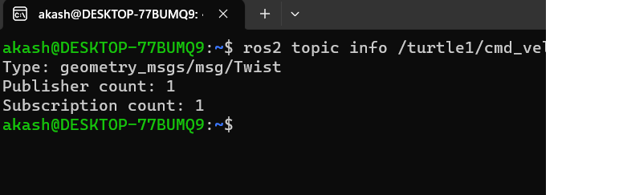

 ### ros2 interface show
 ros2 topic communicate with each other `via message`. We can see the type of message being published using following command. Publisher and Subscriber must send and receive same msg type in order to communicate. 

 From our previous knowledge we know that `cmd_vel` has topic type: `geometry_msgs/msg/Twist`.  This means that in  ``package geometry_msgs`` there is a msg called ``Twist``. 

We can learn the detail of the particular message by using comand
> command: ros2 inferace show *topic type*

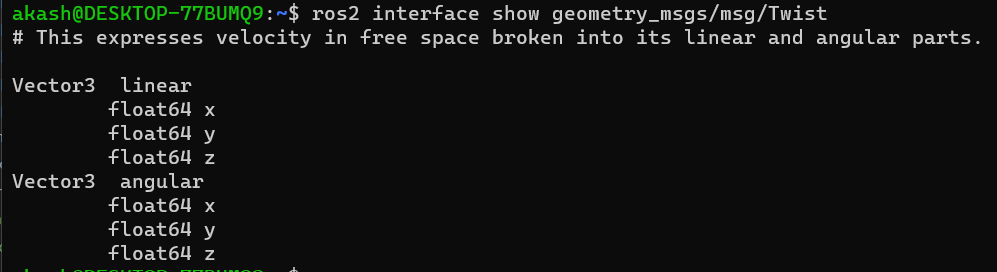

The above information tells us that '/turtlesim' node is expecting a message with two vectos: `linear` and `angular`, each of them have 3 elements of float64 type.

This is the same type that was being echo in our previous turtorial. 


*we can use this information to publish message from node.*

### ros2 topic pub
: used to publish data onto a topic using a command.*note: you need to know the message type in prior to this.*
> command: ros2 topic pub *topic_name* *msg_type* '*args*'
<br>*note: you will pass the desired data using args argument*


Use command : ros2 topic pub --once /turtle1/cmd_vel geometry_msgs/msg/Twist "{linear: {x: 2.0, y: 0.0, z: 0.0}, angular: {x: 0.0, y: 0.0, z: 1.8}}"


Here, above since we use --once this data will only be published signle time. *Optionally we can use ``--rate ` to determine the freqeuncy* to publish data continously 

Result : 

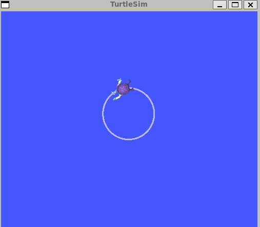

```
Refresing the rqt graph to see what is happning, you can see additional 
```

### ros2 topic hz
: return the frequency of the message being published. 
> command: ros2 topic hz *topic name*
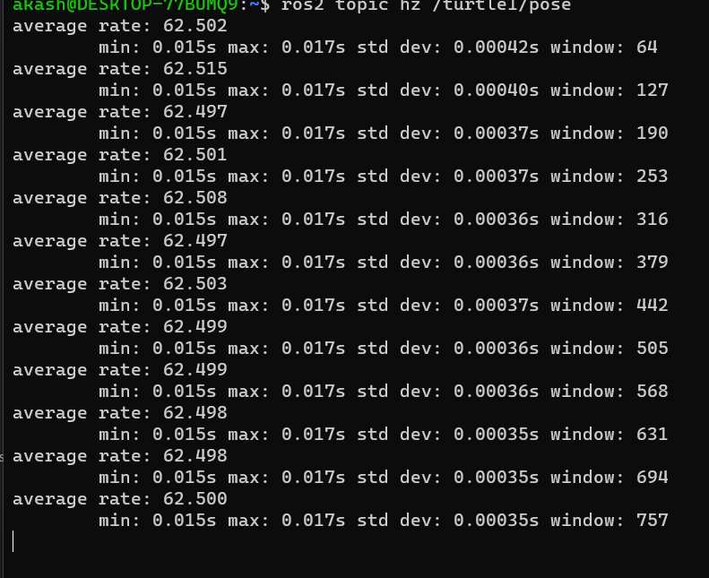

## ros2 `services`
- services are another method of commincation.
- communication is made between `server` and `client.`
- communication mode is through `Request message` and `Response message` mode
- using the same service, multiple `servers` and `clients` can communicate to each other. 

### Task
Open two terminal and run : `ros2 run turtlesim turtlesim_node` , and ``ros2 run turtlesim turtle_teleop_key``. 

### ros2 service list
: list all the active services
>command: ros2 service list
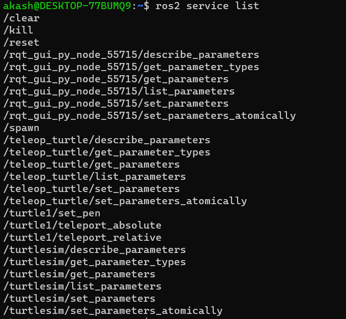

### ros2 service type
: return the type of a particular server
> command : ros2 service type *service name*
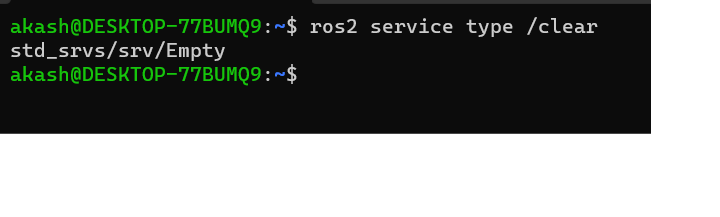

*Note: you can directly use ``ros2 service list -t`` to see all the active service with its types. *

### ros2 service find
: to find all the service of the same kind.
> command: ros2 service find *service type*

`clear` has type ``std_srvs/srv/Empty``
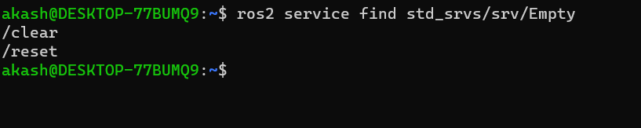

### ros2 inferace show
: return the message type of particular `service type.`
> command: ros2 service inference show *type_name*

- ros2 interface show std_srvs/srv/Empty 
    - return `---` as the name suggest.


lets try: `ros2 interface show turtlesim/srv/Spawn`
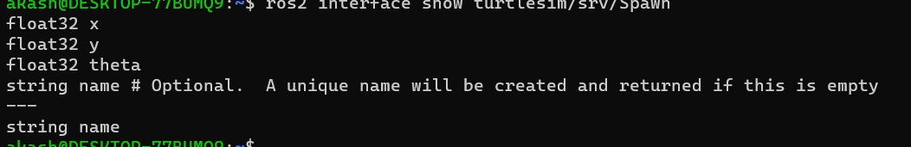

The information above the --- line tells us the arguments needed to call /spawn. x, y and theta determine the 2D pose of the spawned turtle, and name is clearly optional.

### ros2 service call
: directly call the service from the command line 

> command: ros2 service call *service_name* *service_type* *argument*<br> *note if type is `Empty` no need to pass any argument.*
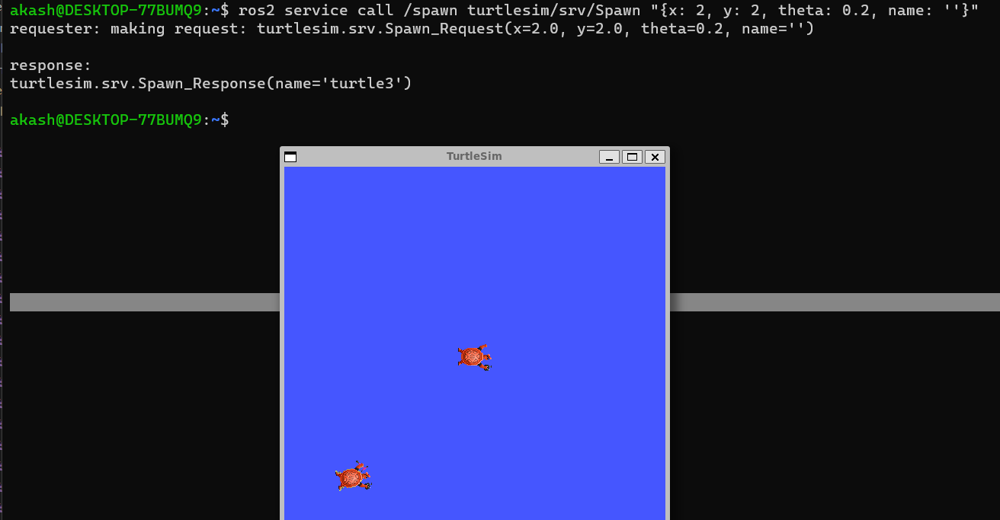