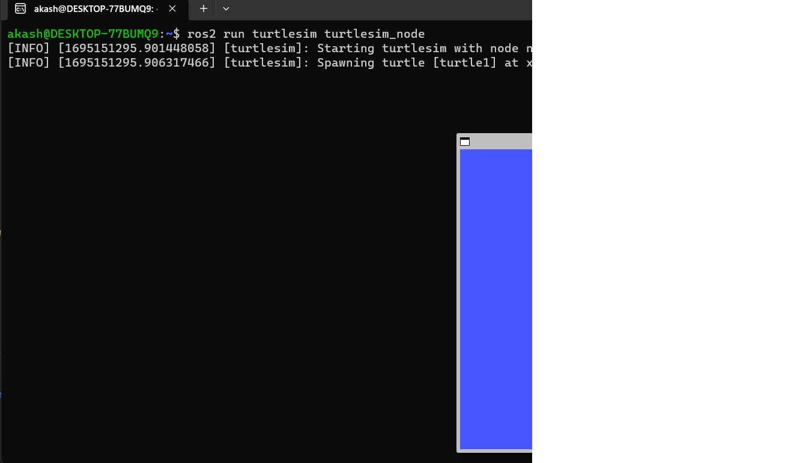

# Begineer: cli commands 

## Using `turtlesim`, `ros2`, and `rqt`

### Installing: turtlesim and rqt using bash file

1. Change the bash file to executable, to do this run:
> sudo chmod 777 -R .

2. After this, execute the bash file:
> ./install_turtlesim_rqt.bash

### About Turtlesim
Turtlesim is a lightweight simulator for learning ROS 2. It illustrates what ROS 2 does at the most basic level to give you an idea of what you will do with a real robot or a robot simulation later on.

1. Verify if the package is installed or not
> ros2 pkg executables turtlesim

2. Start turtlesim
> ros2 run turtlesim turtlesim_node

The above command will open a simulator window.

3. Use turtlesim
In order to use turtlesim, we need to open a new node to control it:
> ros2 run turtlesim turtle_teleop_key

A new terminal will open, and you can use the arrow button to control the turtlebot in the simulator.

4. Using `ros2` tools such as: `ros2 node list`,  `ros2 topic list`, `ros2 service list`, `ros2 action list`,

### About rqt
rqt is GUI tools for ROS2. It provides a user-friendly way to manipulate ROS2 elements. *Note: Everything that can be done using rqt can also be done using the command line.*

1. Opening rqt
> rqt

For the first time, the window will appear as blank. Just select `Plugins > Services > Service Caller` from the menu bar at the top.

2. Try the spawn service
From the list option, select /spawn. This will create another turtle in the turtlesim.

Now, when you `refresh`, then you can see the `turtle2` service as well.

3. Try the set_pen service
We will change the color of the line and its width to 'red' and '5', respectively.

## Understanding nodes

We will learn about the function of nodes in `ROS2`, and the tools to interact with them. 

### Ros2 Graph
 ROS graph is a network of ROS2 elements processing data together at the same time.

 ## Nodes
 Nod is a standalone process that performs a specific task or set of tasks within robotics system.  Node can communicate `one to one`, or `one to many`, or `many to one` , or `many to many` .  ROS node communicate each other via `topics, actions or parameters.`

 ``Some important ros2 command``
### ros2 run

 ***launches an executable from a package.***

 > ros2 run package_name executable_name
 
package name:   refers to the name of the ROS 2 package that contains the executable  you want to run.

executable_name:  refers to the name of the executable binary (or script) you want to run.
  

 For example in our previous turtlesim, we use 

 > ros2 run turtlesim turtlesim_node

Here, ``turtlesim`` is `package name` and `turtlesim_node`  is `executable_node`

### ros2 node list

***This will show the list of all runing nodes***

Example, i run two node: a) ros2 run turtlesim turtlesim_node , and b) ros2 run turtlesim turtle_teleop_key. 

After running, ros2 node list: 

/teleop_turtle  
/turtlesim

### Remapping
`Remapping`: allos to reassign default name properties, like node name, topic name

We will change the node name of `turtlesim_node` to   `turtle_akash`

## ros2 node info
 to access the information of particular node

 > ros2 node info /`node_name`

 