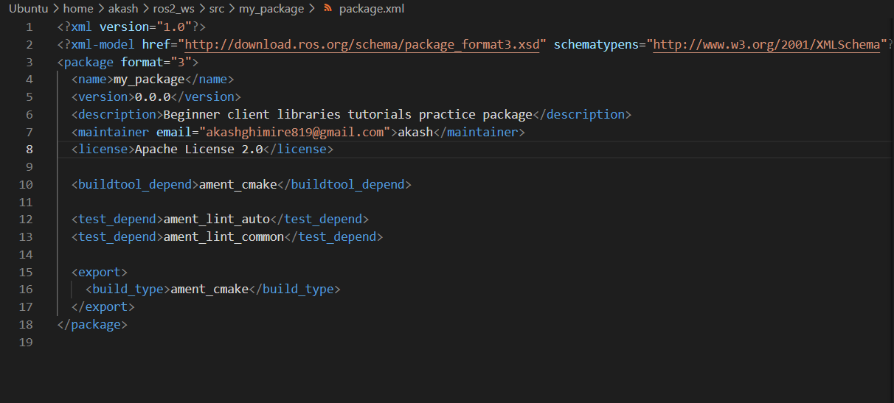
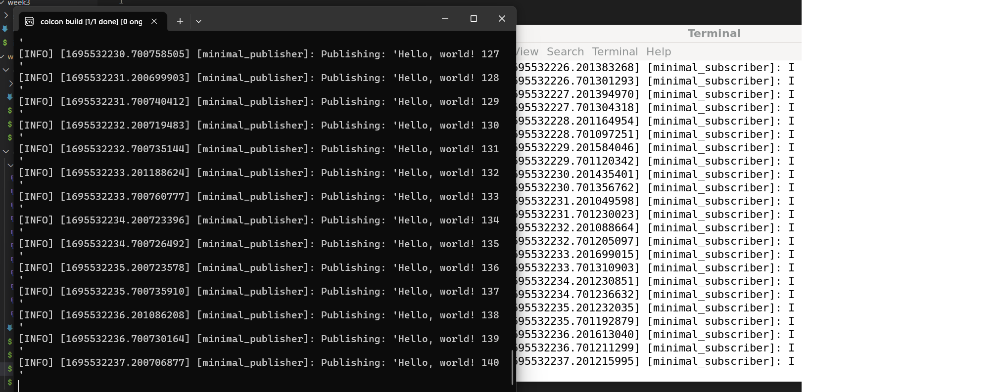

# Begineer: cli commands 

In this readmefile, we will learn how about fundamentals of ``Client Libraries`` used in ROS2. We have used ROS2 humble version in this turtorial.  This section have sub-turtorials on: 

## Using `colcon` to build packages

The first  step is to create a working space to run our customised package. In ``ROS2`` we do this by using `colcon enviroment. `

The shell script to create our first ros2_ws is `./week4/colcon_build_packages.sh`. To run this shell script do the follwoing steps: 
- chanage it to executable: sudo chmod +x colcon_build_packages.sh
- Run the executable files


<br>


***We are trying to create an overlay; We will git clone source code from a git repository.***


This will create a folder `ros_ws` , and we clone source file. We finally build it using 
> colcon build --symlink-install

After building we have other folders, as shown in figure:


- we run the test to see if package we build is running successfully.

> colcon test

- sourcing the enviroment
This is important so ros executable is recognized by ros2 command. 
> source install/setup.bash

- Now we run the publisher and subscriber executable

> ros2 run examples_rclcpp_minimal_subscriber subscriber_member_function
<br>
> ros2 run examples_rclcpp_minimal_publisher publisher_member_function

### Creating your own package
colcon uses `package.xml`. The reccomended way to build is `ament_cmake`. It also support `cmake` aswell. 

### Setting `colcon_cd`
We can use `colcon_cd` to quickly change the working directory of your shell.

### Setup `colcon` tab completion
This will make the work easy. We can do this by: 
> echo "source /usr/share/colcon_argcomplete/hook/colcon-argcomplete.bash" >> ~/.bashrc


## 2. Creating a ws

A package serves as a structured unit for your ROS 2 programming. For easy installation, distribution, or sharing of your code, it's essential to package it. By packaging your ROS 2 project, you make it accessible and straightforward for others to utilize and build upon.

To run this, follow these steps:
- chanage it to executable: sudo chmod +x create_ws.sh
- Run the executable files: ./create_package.sh

### Package in a workspace

We will continue on our previous turtorial. The custom workspace is called `overlay`. We will again create another worspace `ros2_ws2`. It is recommended to create new ws everytime for a new project.   Each of these workspace folder should contain `src` folder, and we will want to create a package there. A src folder can contain many `package`. Here in this this turtorial we will clone source code from a repository and build a `turtlesim`. We will also modify the turtlesim executable, and show the difference between `underlay` and `overlap` turtlesim.

Sucessfull build: 


Under `src` folder contains `package` folder. Each `package` has its own `src` folder which contains executable as well as other thing such as .xml file. 

We will change the `Window Title` to `MyTurtlesim` of cpp executable file ``~/ros2_w2/src/ros_tutorials/turtlesim/src/turtle_frame.cpp``


You can see the change as 


### 3. Creating Package

We will create a simle `my package`. In order to do this run: 

- chmod +x create_pkg.sh
-  ./create_pkg.sh


In the working folder, under src you can see folder `my_package`. Under it you can see its own `src` as well as `package.xml`


We will modify, package.xml as follow


### 4. Creating publisher subscriber cpp 

First, run the following commands: 
-  chmod +x create_sub_pub_cpp.sh
- ./create_sub_pub_cpp.sh

This will create a new package `cpp_pubsub`. After that we will download cpp src file of publisher and subscriber. 
On the first time, you will see the error, that we don't have executable file. This is because we have not updated dependencies before building it. 

Updating Dependencies, first updating `package.xml` and as previously, plus we also add dependencies: `rclcpp` and `stdmsgs`.


After this update `CMakeLists.txt`


Here, we add the executable. and name the publisher and subscriber `talker` and `listener`.

``After building, again run the executable to properly build dependencies. ``


### 4. Creating publisher subscriber py

We will create publisher subscriber, now in py version.
-  chmod +x create_sub_pub_py.sh
- ./create_sub_pub_py.sh

Run the executable for the first time to download necessary source file. After that you have to add dependencies similar to above in `package.xml`. This time we will update `setup.py`


### 5. Writing a simple service and client
We will create publisher subscriber, now in py version.
-  chmod +x create_ser_py.sh
- ./create_ser_py.sh

This will create the serice folder in the ros_ws as shown: 


- Updating `package.xml` and `.srv file`. 
```
  <description>Python client server tutorial</description>
  <maintainer email="akashghimire819@email.com">Your Name</maintainer>
  <license>Apache License 2.0</license>

```

- updating `setup.py`
```
maintainer='Your Name',
maintainer_email='akashghimire819@email.com',
description='Python client server tutorial',
license='Apache License 2.0',

```

```
entry_points={
    'console_scripts': [
        'service = py_srvcli.service_member_function:main',
        'client = py_srvcli.client_member_function:main',
    ],
},
```


The shell script will create empty python file designated for `service` and `client`. We will copy the code from turtorial and paste there. 


Now, after updating configuration, again run ,`./create_ser_py.sh`, and get the following result. 


## 6. Creating Custom msg and srv files

This have two shell script file, first run 
> ./create_msgs_py.sh

After that, update the `.msg` and `.srv` files. After it run the shell, you will get the output as : 

Modify `package.xml` from pub sub package of python


Run another shell scripts: 

Now, we will update our publisher(talker) and listerner based on the new msg and srv interface

execute: 
>./create_msgs_2.sh


# ros2doctor
ros2 doctor is a command-line tool introduced in ROS 2 to help diagnose issues in a ROS 2 environment. The tool checks the environment, displays a report of the checks, and highlights any potential issues. 

You can check status of `ROS 2` in your system with the followng commands
- chmod +x ros2_doctor.sh
- ./ros2_doctor.sh

