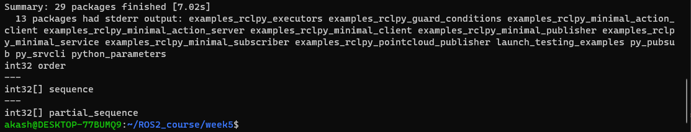
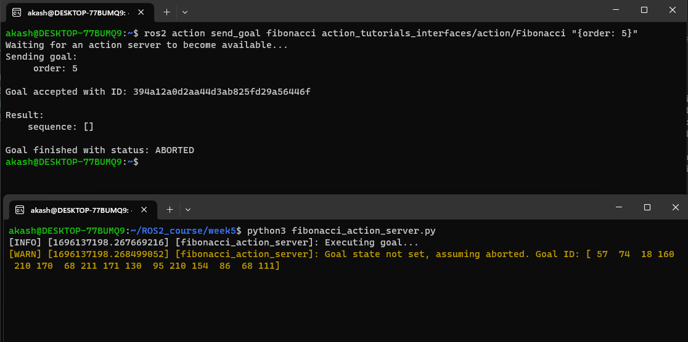
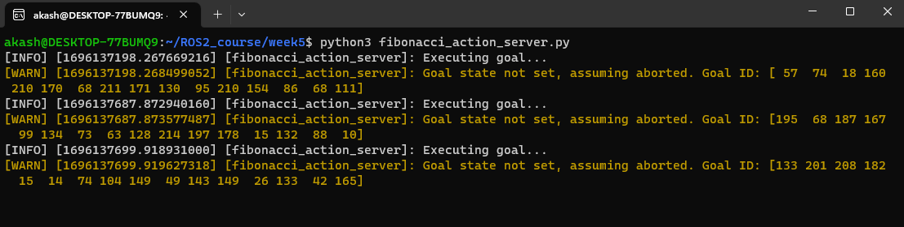
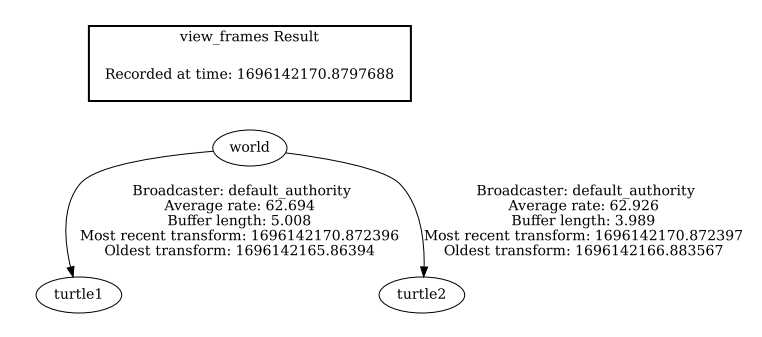
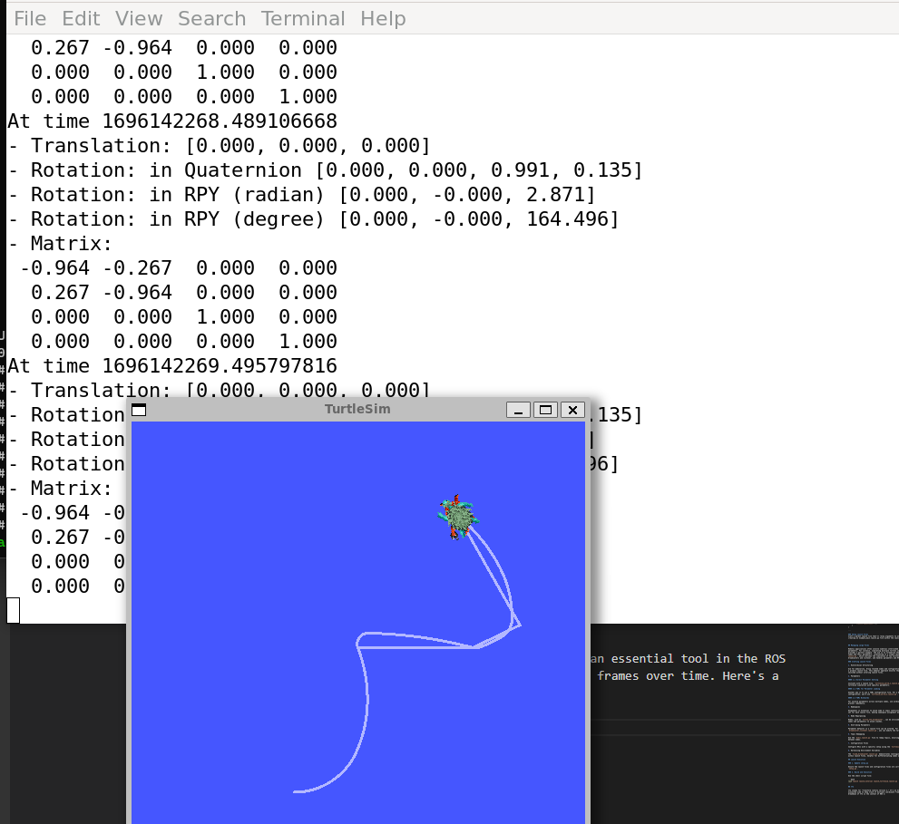
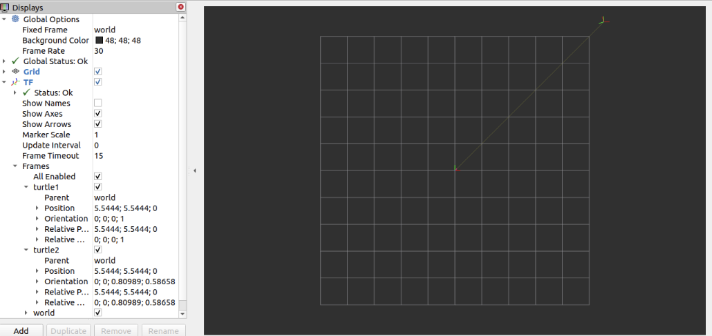
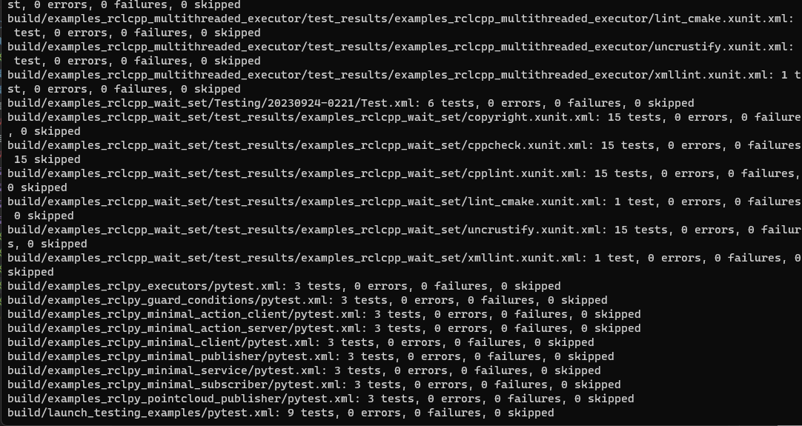

# ROS2 Intermediate

*Note:* Make sure you make all the shell script inside this folder executable. 
> sudo chmod +x week5

## 1. Managing Dependencies with rosdep 

### What is rosdep?
Rosdep is a command-line tool for managing dependencies in packages and libraries. It helps identify and install the necessary dependencies for building or installing a package. It uses its knowledge to find the right package for your platform and relies on the system's package manager for the actual installation.

About package.xml files:
The package.xml file contains a package's list of dependencies, referred to as "rosdep keys." Ensuring accuracy and completeness in this list is crucial for proper functionality, as missing or incorrect dependencies can lead to various issues.

### Rosdep Categories:

<depend>: Dependencies needed at both build and runtime.<br>    
<build_depend>: Dependencies only required during the package's build process.<br>
<build_export_depend>: Needed when your package exports headers with dependencies.<br>
<exec_depend>: Declarations for dependencies essential during package execution.<br>
<test_depend>: Dependencies exclusively used for testing, without overlap with others.<br>

### How rosdep works:
Rosdep scans for package.xml files, extracts rosdep keys, and cross-references them with an index to locate the necessary ROS packages or software libraries across package managers. Once found, these packages are installed and ready for use.

### How do I use the rosdep tool? 

Run the shellscript: ``./script1.sh``


This script updates packages, installs `python3-rosdep`, installs `pip` for Python 3, installs `rosdep` using `pip3`, initializes `rosdep`, and updates its package index.

## 2. Creating an action

Actions are defined in .action files, consisting of three message definitions separated by '---':

- Request: Sent from an action client to initiate a new goal.
- Result: Sent from the action server when the goal is completed.
- Feedback: Periodically sent from the action server to provide goal updates

For example, to create a "Fibonacci" action:

1. In your ROS 2 package "action_tutorials_interfaces," create an "action" directory.
2. Inside it, create "Fibonacci.action" with the specified message structure:

    - Request: Desired order of the Fibonacci sequence.
    - Result: Final sequence.
    - Feedback: Updates on the partial sequence computed.


### Building An Action 
To use the "Fibonacci" action:

1. In "CMakeLists.txt," add these lines before "ament_package()" in the "action_tutorials_interfaces" package:
2. Find and generate the action interfaces.
Include dependencies in "package.xml," such as "rosidl_default_generators" and "action_msgs."
3. Build the package with the appropriate command.

### Naming Convention 

Action types typically follow the package name and "action" prefix. In this case, your action is named "action_tutorials_interfaces/action/Fibonacci."

### Running the shell script
Run the shellscript: ``./action.sh``

This will create the necessary files. Once it has been created make necessary changes as mention above. and then rerun again. 

The output will look like this: 



### Writing an action server and client (Python)


In this tutorial, we will focus on writing an action server that computes the Fibonacci sequence using the action we previously created. For simplicity, this tutorial will scope the action server to a single file.

## 1. Setting Up the Action Server

Create a new file in your home directory named `fibonacci_action_server.py` and paste the following code:

```python
import rclpy
from rclpy.action import ActionServer
from rclpy.node import Node
from action_tutorials_interfaces.action import Fibonacci

import time

import rclpy
from rclpy.action import ActionServer
from rclpy.node import Node

from action_tutorials_interfaces.action import Fibonacci


class FibonacciActionServer(Node):

    def __init__(self):
        super().__init__('fibonacci_action_server')
        self._action_server = ActionServer(
            self,
            Fibonacci,
            'fibonacci',
            self.execute_callback)

    def execute_callback(self, goal_handle):
        self.get_logger().info('Executing goal...')

        feedback_msg = Fibonacci.Feedback()
        feedback_msg.partial_sequence = [0, 1]

        for i in range(1, goal_handle.request.order):
            feedback_msg.partial_sequence.append(
                feedback_msg.partial_sequence[i] + feedback_msg.partial_sequence[i-1])
            self.get_logger().info('Feedback: {0}'.format(feedback_msg.partial_sequence))
            goal_handle.publish_feedback(feedback_msg)
            time.sleep(1)

        goal_handle.succeed()

        result = Fibonacci.Result()
        result.sequence = feedback_msg.partial_sequence
        return result


def main(args=None):
    rclpy.init(args=args)

    fibonacci_action_server = FibonacciActionServer()

    rclpy.spin(fibonacci_action_server)


if __name__ == '__main__':
    main()

```

Similarly, we will also create one for client:
```python

import time


import rclpy
from rclpy.action import ActionServer
from rclpy.node import Node

from action_tutorials_interfaces.action import Fibonacci


class FibonacciActionServer(Node):

    def __init__(self):
        super().__init__('fibonacci_action_server')
        self._action_server = ActionServer(
            self,
            Fibonacci,
            'fibonacci',
            self.execute_callback)

    def execute_callback(self, goal_handle):
        self.get_logger().info('Executing goal...')


        feedback_msg = Fibonacci.Feedback()

        feedback_msg.partial_sequence = [0, 1]


        for i in range(1, goal_handle.request.order):

            feedback_msg.partial_sequence.append(

                feedback_msg.partial_sequence[i] + feedback_msg.partial_sequence[i-1])

            self.get_logger().info('Feedback: {0}'.format(feedback_msg.partial_sequence))

            goal_handle.publish_feedback(feedback_msg)

            time.sleep(1)


        goal_handle.succeed()

        result = Fibonacci.Result()

        result.sequence = feedback_msg.partial_sequence

        return result


def main(args=None):
    rclpy.init(args=args)

    fibonacci_action_server = FibonacciActionServer()

    rclpy.spin(fibonacci_action_server)


if __name__ == '__main__':
    main()


``` 

### Code Explanation

- **Class Definition**: The `FibonacciActionServer` is a subclass of `Node`, as seen on Line 8.

- **Initialization**: 
  - Inside the class, the `__init__` method is responsible for initializing our node with the name `fibonacci_action_server` and also setting up the action server. 
  - The action server is instantiated with four main arguments:
    1. The ROS 2 node (`self`).
    2. The action type (`Fibonacci`).
    3. The action name ('fibonacci').
    4. A callback function (`self.execute_callback`) which gets executed upon accepting a goal.

- **Executing Callback**: The `execute_callback` method, which is defined in our class, is called upon goal execution. It simply logs a message and returns an instance of `Fibonacci.Result`.

### Snippets 



## 3. ROS 2 Launch System Overview

The ROS 2 launch system aids in defining, configuring, and executing complex systems of nodes, ensuring smoother system setups and operations.

### Background

- The launch system allows users to describe their system's configuration and ensures it's executed as defined.
- It takes care of aspects like which programs to run, where to run them, their arguments, and other ROS-specific conventions.
- Configuration can be described in Python, XML, or YAML, providing flexibility for the user.
- Monitoring the state of the processes and reacting to any state changes is also one of its responsibilities.
  
### Tasks

Setting up Launch Files

- Create a new directory named `launch` to store your launch files: `mkdir launch`.

Writing the Launch File using Turtlesim

- For this example, we use the `turtlesim` package and its executables to demonstrate a launch file. 
- The goal is to launch two turtlesim windows where one turtle mimics the movements of the other.
- Each turtle receives commands over the same topic and publishes their pose over the same topic, but unique namespaces help avoid conflicts.
  
```python
from launch import LaunchDescription
from launch_ros.actions import Node

def generate_launch_description():
    # ... [content trimmed for brevity]

```

### Using Substitutions in ROS 2 Launch Files


## Introduction
In ROS 2, launch files initialize nodes, kick-off services, and run processes. Their behavior can be influenced by arguments. To introduce flexibility in launch files, substitutions are employed. They get evaluated during launch execution and can fetch data like configurations or evaluate Python snippets. This guide sheds light on their practical application.

## Setup Requirements
This guide hinges on the `turtlesim` package. Prior experience with package creation is beneficial. As a reminder, ensure ROS 2 is sourced in every terminal instance.

## Working with Substitutions

### 1. Initializing the Package
Kick off by setting up a package named `launch_tutorial` with a `ament_python` build type:
```bash
ros2 pkg create launch_tutorial --build-type ament_python
```

Wrap up by adapting the setup.py file to ensure the launch files are correctly incorporated:
```python
import os
from glob import glob
from setuptools import setup

pkg_name = 'launch_tutorial'
setup(
    # ... (Further parameters)
    data_files=[
        # ... (Additional data files)
        # Embed launch files.
        (os.path.join('share', pkg_name, 'launch'), glob(os.path.join('launch', '*launch.[pxy][yma]*')))
    ]
)

```

### Setup Launch Files
Craft a parent launch file that'll relay arguments to another. This step requires creating an example_main.launch.py file within the launch directory.


## Managing Large Files

Robotic applications often involve numerous interlinked nodes, each laden with parameters. For instance, simulating multiple turtles in the turtle simulator provides a perfect example. The aim is to streamline the initialization of these nodes and their parameters, culminating in a single launch file, `launch_turtlesim.launch.py`, which oversees the simulation of two turtlesim simulations, starts TF broadcasters and listener, and handles parameters and RViz configurations.

### Crafting Launch Files

1. Hierarchical Structuring

Aim for modularity. Group related nodes and configurations and then refer to them via a primary launch file. This modular approach ensures that similar robots can be switched without altering launch files.

2. Parameters

#### 2.1 Direct Parameter Setting

Initiate with a launch file, `turtlesim_world_1.launch.py`, which starts the turtlesim simulation with specific parameters.

#### 2.2 YAML for Parameter Loading

Another way is to use a YAML configuration file. For a different simulation configuration, you'd use `turtlesim_world_2.launch.py`.

#### 2.3 YAML Wildcards

For uniform parameters across multiple nodes, use wildcard characters in YAML to prevent redundancy.

3. Namespaces

Uniqueness is essential to avoid node or topic conflicts. Global namespaces can be set for each launch file, making namespace assignment more manageable.

4. Node Repurposing

Nodes, such as `turtle_tf2_broadcaster`, can be utilized multiple times with varied names and parameters to avoid clashes.

5. Overriding Parameters

Parameter defaults in a launch file can be altered. For instance, in the `broadcaster_listener.launch.py`, you can modify the target frame.

6. Topic Remapping

Use the `mimic.launch.py` file to remap topics, ensuring seamless communication between nodes.

7. Configuration Files

Configure RViz with a specific setup using the `turtlesim_rviz.launch.py` file.

8. Harnessing Environment Variables

The `fixed_broadcaster.launch.py` demonstrates leveraging environment variables within launch files, helpful for differentiating nodes across systems.

## Launch Execution

### 1. Update setup.py

Ensure the launch files and configuration files are correctly referenced in the `setup.py`.

### 2. Build and Execution

Use the shell script file: 

```bash
ros2 launch launch_tutorial launch_turtlesim.launch.py
```

## tf2

tf2 stands for "transform library version 2." It's an essential tool in the ROS ecosystem used to keep track of multiple coordinate frames over time. Here's a breakdown of tf2 in the context of ROS 2:
Run the bash file
```bash
chmod +x tf2_install.sh
./tf2_install.sh
```
### Snippets





### Explanation 
## Under the Hood

In this demonstration, we utilize the `tf2` library to set up three distinct coordinate frames: the global realm, and two specific frames, `turtle1` and `turtle2`. By utilizing a `tf2` broadcaster, the turtle frames are disseminated. Concurrently, the `tf2` listener is engaged to identify and process the variances between these turtle frames, ensuring one turtle mirrors the other's actions.


# Testing


## Building and Running Your Tests

To compile and execute the tests, utilize the `test` verb from `colcon`:

\```bash
colcon test --ctest-args tests [package_selection_args]
\```

> **Note:** The `package_selection_args` are optional package selection arguments. They allow `colcon` to filter which packages to build and run. 

It's worth mentioning that you shouldn't need to source the workspace before testing. `colcon test` ensures that the tests run within the appropriate environment and can access their dependencies.

## Reviewing Test Results

To view the test results, use the `test-result` verb from `colcon`:

\```bash
colcon test-result --all
\```

For a more detailed view of failed test cases, add the `--verbose` flag:

\```bash
colcon test-result --all --verbose
\```

## Debugging Tests with GDB

If a C++ test fails, you can directly use `gdb` on the test executable in the build directory. Remember to build the code in debug mode. As CMake may cache the previous build type, clean the cache before rebuilding:

\```bash
colcon build --cmake-clean-cache --mixin debug
\```

To debug, run the test directly via `gdb`. For instance:

\```bash
gdb -ex run ./build/rcl/test/test_logging

\```


## Running the bash file 
Run the bash file
```bash
chmod +x tester.sh
./tester.sh
```

## Snippets


# URDF :Building a visual robot model from scratch
``URDF, or the Unified Robot Description Format``, is an integral part of the Robot Operating System (ROS) ecosystem. It offers a standardized and systematic way to describe a robot's physical structure, including its joints, links, and other components. This consistent representation is essential for multiple reasons. Firstly, it facilitates the visualization of the robot, allowing designers and developers to confirm its configuration. Secondly, with a proper URDF, robots can be simulated in environments like Gazebo, enabling testing and validation before deploying algorithms or behaviors on real hardware. Additionally, the URDF's detailed description supports the computation of kinematics and dynamics, which are crucial for robot movement planning and control. The format also captures the robot's physical properties and collision geometries, essential for accurate interaction with its environment. The flexibility of URDF is further enhanced by Xacro, an XML macro language, which makes defining complex robots more manageable and modular. In essence, URDF streamlines and standardizes how robots are represented, ensuring compatibility and ease of integration across various ROS tools and libraries.


first step  is to  installed joint_state_publisher and urdf_tutorial packages


Launch the display.launch.py file:

```
ros2 launch urdf_tutorial display.launch.py model:=urdf/01-myfirst.urdf
```

## One Shape

```
<?xml version="1.0"?>
<robot name="myfirst">
  <link name="base_link">
    <visual>
      <geometry>
        <cylinder length="0.6" radius="0.2"/>
      </geometry>
    </visual>
  </link>
</robot>
```

The process performs the following tasks:

- Retrieves the designated model and stores it as a parameter.

- Executes nodes to broadcast sensor_msgs/msg/JointState and transformation information.

- Initiates Rviz using a predefined configuration setup.


A slightly modified argument allows this to work regardless of the current working directory:

```
ros2 launch urdf_tutorial display.launch.py model:=`ros2 pkg prefix --share urdf_tutorial`/urdf/01-myfirst.urdf
```

After launching display.launch.py, you should end up with RViz showing you the following:


#### Multiple Shape

To incorporate multiple shapes or links, it's not enough to simply append more link elements in the URDF. For correct positioning, joints are required. The joint elements can represent both movable and fixed joints.

```
<?xml version="1.0"?>
<robot name="multipleshapes">
  <link name="base_link">
    <visual>
      <geometry>
        <cylinder length="0.6" radius="0.2"/>
      </geometry>
    </visual>
  </link>

  <link name="right_leg">
    <visual>
      <geometry>
        <box size="0.6 0.1 0.2"/>
      </geometry>
    </visual>
  </link>

  <joint name="base_to_right_leg" type="fixed">
    <parent link="base_link"/>
    <child link="right_leg"/>
  </joint>

</robot>
```


Both of the shapes overlap with each other, because they share the same origin. If we want them not to overlap we must define more origins.


#### Origins

The leg of R2D2 connects to the upper portion of his torso, specifically on the side. This is the exact location where we define the origin of the JOINT.

```
<?xml version="1.0"?>
<robot name="origins">
  <link name="base_link">
    <visual>
      <geometry>
        <cylinder length="0.6" radius="0.2"/>
      </geometry>
    </visual>
  </link>

  <link name="right_leg">
    <visual>
      <geometry>
        <box size="0.6 0.1 0.2"/>
      </geometry>
      <origin rpy="0 1.57075 0" xyz="0 0 -0.3"/>
    </visual>
  </link>

  <joint name="base_to_right_leg" type="fixed">
    <parent link="base_link"/>
    <child link="right_leg"/>
    <origin xyz="0 -0.22 0.25"/>
  </joint>

</robot>
```

We also rotate the leg so it is upright:

```
ros2 launch urdf_tutorial display.launch.py model:=urdf/03-origins.urdf
```


- The launch file operates packages that generate TF frames for every link in your design, drawing from your URDF. Rviz leverages this data to determine the position of each form.

- When there's no TF frame for a specific URDF link, it will be positioned at the origin and displayed in white.

#### Material Girl

```
<?xml version="1.0"?>
<robot name="materials">

  <material name="blue">
    <color rgba="0 0 0.8 1"/>
  </material>

  <material name="white">
    <color rgba="1 1 1 1"/>
  </material>

  <link name="base_link">
    <visual>
      <geometry>
        <cylinder length="0.6" radius="0.2"/>
      </geometry>
      <material name="blue"/>
    </visual>
  </link>

  <link name="right_leg">
    <visual>
      <geometry>
        <box size="0.6 0.1 0.2"/>
      </geometry>
      <origin rpy="0 1.57075 0" xyz="0 0 -0.3"/>
      <material name="white"/>
    </visual>
  </link>

  <joint name="base_to_right_leg" type="fixed">
    <parent link="base_link"/>
    <child link="right_leg"/>
    <origin xyz="0 -0.22 0.25"/>
  </joint>

  <link name="left_leg">
    <visual>
      <geometry>
        <box size="0.6 0.1 0.2"/>
      </geometry>
      <origin rpy="0 1.57075 0" xyz="0 0 -0.3"/>
      <material name="white"/>
    </visual>
  </link>

  <joint name="base_to_left_leg" type="fixed">
    <parent link="base_link"/>
    <child link="left_leg"/>
    <origin xyz="0 0.22 0.25"/>
  </joint>

</robot>
```


- The body now displays a blue hue. A fresh material named "blue" has been outlined, with its red, green, blue, and alpha channels set at 0, 0, 0.8, and 1 respectively. The range for these values lies between [0,1]. The visual element of the base_link then utilizes this material. Another material, white, is crafted in a similar manner.

- It's possible to establish the material tag right within the visual component and even reference it across other links. There won't be any objections even if you redefine the material.

- Furthermore, we have the option to employ a texture, allowing us to use an image file for determining the object's color.

```
ros2 launch urdf_tutorial display.launch.py model:=urdf/04-materials.urdf
```


## Finishing the Model

Now we finish the model off with a few more shapes: feet, wheels, and head. Most notably, we add a sphere and a some meshes

```
<?xml version="1.0"?>
<robot name="visual">

  <material name="blue">
    <color rgba="0 0 0.8 1"/>
  </material>
  <material name="black">
    <color rgba="0 0 0 1"/>
  </material>
  <material name="white">
    <color rgba="1 1 1 1"/>
  </material>

  <link name="base_link">
    <visual>
      <geometry>
        <cylinder length="0.6" radius="0.2"/>
      </geometry>
      <material name="blue"/>
    </visual>
  </link>

  <link name="right_leg">
    <visual>
      <geometry>
        <box size="0.6 0.1 0.2"/>
      </geometry>
      <origin rpy="0 1.57075 0" xyz="0 0 -0.3"/>
      <material name="white"/>
    </visual>
  </link>

  <joint name="base_to_right_leg" type="fixed">
    <parent link="base_link"/>
    <child link="right_leg"/>
    <origin xyz="0 -0.22 0.25"/>
  </joint>

  <link name="right_base">
    <visual>
      <geometry>
        <box size="0.4 0.1 0.1"/>
      </geometry>
      <material name="white"/>
    </visual>
  </link>

  <joint name="right_base_joint" type="fixed">
    <parent link="right_leg"/>
    <child link="right_base"/>
    <origin xyz="0 0 -0.6"/>
  </joint>

  <link name="right_front_wheel">
    <visual>
      <origin rpy="1.57075 0 0" xyz="0 0 0"/>
      <geometry>
        <cylinder length="0.1" radius="0.035"/>
      </geometry>
      <material name="black"/>
    </visual>
  </link>
  <joint name="right_front_wheel_joint" type="fixed">
    <parent link="right_base"/>
    <child link="right_front_wheel"/>
    <origin rpy="0 0 0" xyz="0.133333333333 0 -0.085"/>
  </joint>

  <link name="right_back_wheel">
    <visual>
      <origin rpy="1.57075 0 0" xyz="0 0 0"/>
      <geometry>
        <cylinder length="0.1" radius="0.035"/>
      </geometry>
      <material name="black"/>
    </visual>
  </link>
  <joint name="right_back_wheel_joint" type="fixed">
    <parent link="right_base"/>
    <child link="right_back_wheel"/>
    <origin rpy="0 0 0" xyz="-0.133333333333 0 -0.085"/>
  </joint>

  <link name="left_leg">
    <visual>
      <geometry>
        <box size="0.6 0.1 0.2"/>
      </geometry>
      <origin rpy="0 1.57075 0" xyz="0 0 -0.3"/>
      <material name="white"/>
    </visual>
  </link>

  <joint name="base_to_left_leg" type="fixed">
    <parent link="base_link"/>
    <child link="left_leg"/>
    <origin xyz="0 0.22 0.25"/>
  </joint>

  <link name="left_base">
    <visual>
      <geometry>
        <box size="0.4 0.1 0.1"/>
      </geometry>
      <material name="white"/>
    </visual>
  </link>

  <joint name="left_base_joint" type="fixed">
    <parent link="left_leg"/>
    <child link="left_base"/>
    <origin xyz="0 0 -0.6"/>
  </joint>

  <link name="left_front_wheel">
    <visual>
      <origin rpy="1.57075 0 0" xyz="0 0 0"/>
      <geometry>
        <cylinder length="0.1" radius="0.035"/>
      </geometry>
      <material name="black"/>
    </visual>
  </link>
  <joint name="left_front_wheel_joint" type="fixed">
    <parent link="left_base"/>
    <child link="left_front_wheel"/>
    <origin rpy="0 0 0" xyz="0.133333333333 0 -0.085"/>
  </joint>

  <link name="left_back_wheel">
    <visual>
      <origin rpy="1.57075 0 0" xyz="0 0 0"/>
      <geometry>
        <cylinder length="0.1" radius="0.035"/>
      </geometry>
      <material name="black"/>
    </visual>
  </link>
  <joint name="left_back_wheel_joint" type="fixed">
    <parent link="left_base"/>
    <child link="left_back_wheel"/>
    <origin rpy="0 0 0" xyz="-0.133333333333 0 -0.085"/>
  </joint>

  <joint name="gripper_extension" type="fixed">
    <parent link="base_link"/>
    <child link="gripper_pole"/>
    <origin rpy="0 0 0" xyz="0.19 0 0.2"/>
  </joint>

  <link name="gripper_pole">
    <visual>
      <geometry>
        <cylinder length="0.2" radius="0.01"/>
      </geometry>
      <origin rpy="0 1.57075 0 " xyz="0.1 0 0"/>
    </visual>
  </link>

  <joint name="left_gripper_joint" type="fixed">
    <origin rpy="0 0 0" xyz="0.2 0.01 0"/>
    <parent link="gripper_pole"/>
    <child link="left_gripper"/>
  </joint>

  <link name="left_gripper">
    <visual>
      <origin rpy="0.0 0 0" xyz="0 0 0"/>
      <geometry>
        <mesh filename="package://urdf_tutorial/meshes/l_finger.dae"/>
      </geometry>
    </visual>
  </link>

  <joint name="left_tip_joint" type="fixed">
    <parent link="left_gripper"/>
    <child link="left_tip"/>
  </joint>

  <link name="left_tip">
    <visual>
      <origin rpy="0.0 0 0" xyz="0.09137 0.00495 0"/>
      <geometry>
        <mesh filename="package://urdf_tutorial/meshes/l_finger_tip.dae"/>
      </geometry>
    </visual>
  </link>
  <joint name="right_gripper_joint" type="fixed">
    <origin rpy="0 0 0" xyz="0.2 -0.01 0"/>
    <parent link="gripper_pole"/>
    <child link="right_gripper"/>
  </joint>

  <link name="right_gripper">
    <visual>
      <origin rpy="-3.1415 0 0" xyz="0 0 0"/>
      <geometry>
        <mesh filename="package://urdf_tutorial/meshes/l_finger.dae"/>
      </geometry>
    </visual>
  </link>

  <joint name="right_tip_joint" type="fixed">
    <parent link="right_gripper"/>
    <child link="right_tip"/>
  </joint>

  <link name="right_tip">
    <visual>
      <origin rpy="-3.1415 0 0" xyz="0.09137 0.00495 0"/>
      <geometry>
        <mesh filename="package://urdf_tutorial/meshes/l_finger_tip.dae"/>
      </geometry>
    </visual>
  </link>

  <link name="head">
    <visual>
      <geometry>
        <sphere radius="0.2"/>
      </geometry>
      <material name="white"/>
    </visual>
  </link>
  <joint name="head_swivel" type="fixed">
    <parent link="base_link"/>
    <child link="head"/>
    <origin xyz="0 0 0.3"/>
  </joint>

  <link name="box">
    <visual>
      <geometry>
        <box size="0.08 0.08 0.08"/>
      </geometry>
      <material name="blue"/>
    </visual>
  </link>

  <joint name="tobox" type="fixed">
    <parent link="head"/>
    <child link="box"/>
    <origin xyz="0.1814 0 0.1414"/>
  </joint>
</robot>
```

```
ros2 launch urdf_tutorial display.launch.py model:=urdf/05-visual.urdf
```


## Running the bash file 
Run the bash file
```bash
chmod +x urdf.sh
./urdf.sh
```