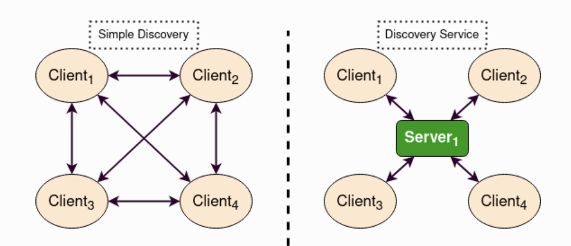
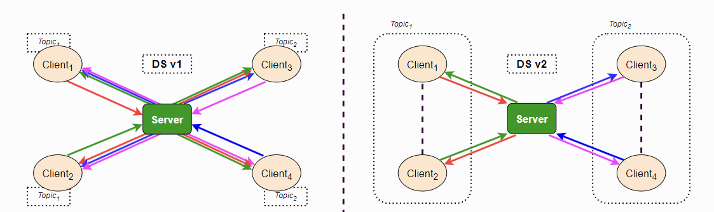
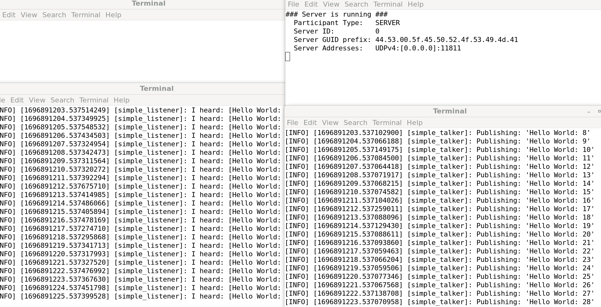

# ROS2 Advanced 

In this turtorial we will be learning on the following topics: 

1. Enabling topic statistics (C++)
2. Using Fast DDS Discovery Server as discovery protocol [community-contributed]
3. Implementing a custom memory allocator
4. Unlocking the potential of Fast DDS middleware [community-contributed]
5. Recording a bag from a node (Python)
6. Reading from a bag file (C++)
7. Simulators
8. Security

## 1. Enabling topic statistics (C++)
Topic Statistics in ROS 2 offers built-in metrics gathering for messages received by any subscription. When enabled for a subscription, Topic Statistics allows for system performance characterization and aids in troubleshooting existing issues.

```bash
cd week6/shell_files
chmod +x top_stat.sh
./top_stat.sh
```

The above command will download executable file to our already created `cpp_pubsub` package which we create in our previous weeks. After that make required changes in `CMakeLists.txt` as follow:
```cmake
add_executable(listener src/subscriber_member_function.cpp)
ament_target_dependencies(listener rclcpp std_msgs)

install(TARGETS
  talker
  listener
  DESTINATION lib/${PROJECT_NAME})
```
And rerun the shell scripts again. 

### Snippets


## 2. Using Fast DDS Discovery Server as discovery protocol [community-contributed]
Starting from ROS 2 Eloquent Elusor, the Fast DDS Discovery Server offers a centralized discovery method, contrasting the default distributed mechanism in DDS. This feature enhances scalability by reducing the traffic associated with node discovery, especially beneficial in large systems. Unlike the standard Simple Discovery Protocol in DDS, which has limitations like inefficient scaling and multicast dependency, the Fast DDS Discovery Server operates on a Client-Server architecture. Nodes act as discovery clients, interacting with the discovery server, eliminating the need for multicasting and ensuring efficient performance even on networks like WiFi.


### FAST DDS Discovery Server V2

The ROS 2 Foxy Fitzroy release in December 2020 introduced version 2 of the Fast DDS Discovery Server. This new version incorporates a filtering feature that uses node topics to decide if two nodes should communicate, allowing them to selectively discover each other. This results in a significant reduction in discovery messages and optimizes network traffic


``Run the following command to execute shell scripts related to this part.`

```bash
cd week6/shell_files
chmod +x fast_dds.sh
./fast_dds.sh
```

### Snippets Result 


## 3. Implementing a custom memory allocator
In this subsection we will implement a custom memeory allocator in ROS2 C++ code.

## 4. Unlocking the potential of Fast DDS middleware [community-contributed]
## 5. Recording a bag from a node (Python)
## 6. Reading from a bag file (C++)
## 7. Simulators
## 8. Security