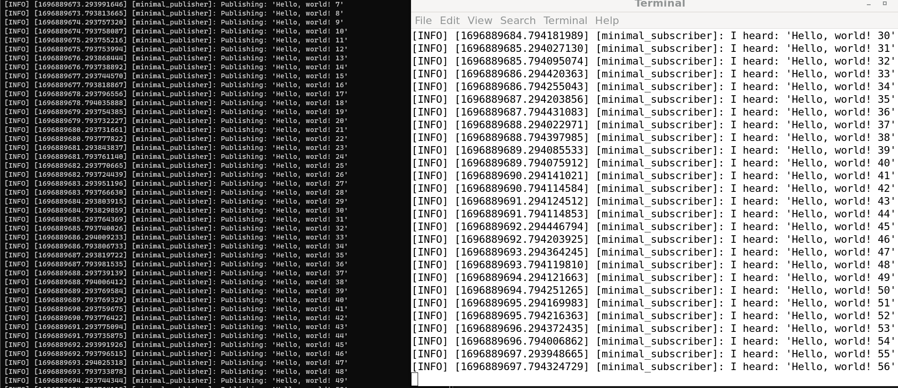

# ROS2 Advanced 

In this turtorial we will be learning on the following topics: 

1. Enabling topic statistics (C++)
2. Using Fast DDS Discovery Server as discovery protocol [community-contributed]
3. Implementing a custom memory allocator
4. Unlocking the potential of Fast DDS middleware [community-contributed]
5. Recording a bag from a node (Python)
6. Reading from a bag file (C++)
7. Simulators
8. Security

## 1. Enabling topic statistics (C++)
Topic Statistics in ROS 2 offers built-in metrics gathering for messages received by any subscription. When enabled for a subscription, Topic Statistics allows for system performance characterization and aids in troubleshooting existing issues.

```bash
cd week6/shell_files
chmod +x top_stat.sh
./top_stat.sh
```

The above command will download executable file to our already created `cpp_pubsub` package which we create in our previous weeks. After that make required changes in `CMakeLists.txt` as follow:
```cmake
add_executable(listener src/subscriber_member_function.cpp)
ament_target_dependencies(listener rclcpp std_msgs)

install(TARGETS
  talker
  listener
  DESTINATION lib/${PROJECT_NAME})
```
And rerun the shell scripts again. 

### Snippets



## 2. Using Fast DDS Discovery Server as discovery protocol [community-contributed]
## 3. Implementing a custom memory allocator
## 4. Unlocking the potential of Fast DDS middleware [community-contributed]
## 5. Recording a bag from a node (Python)
## 6. Reading from a bag file (C++)
## 7. Simulators
## 8. Security