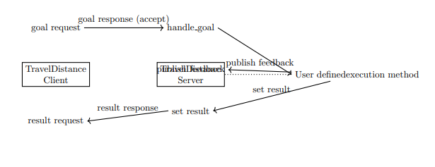
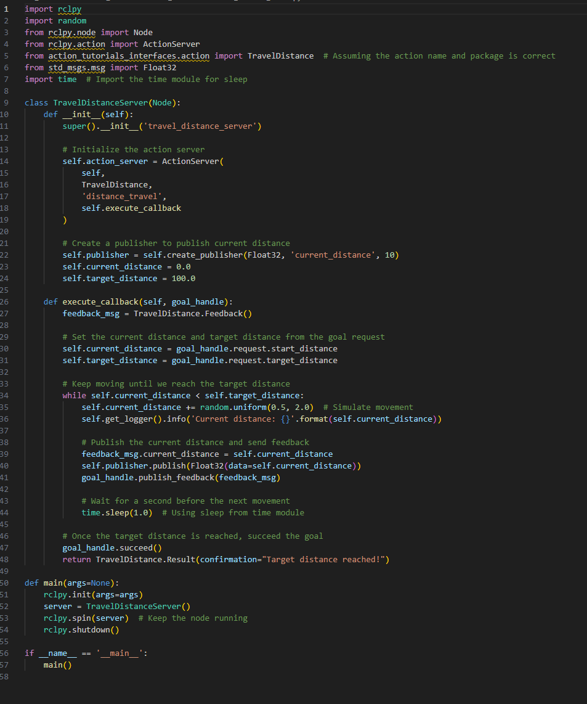
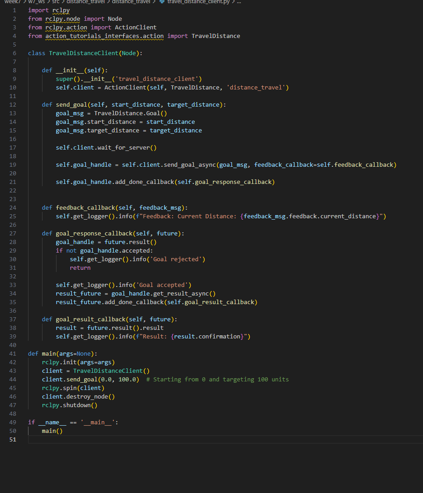
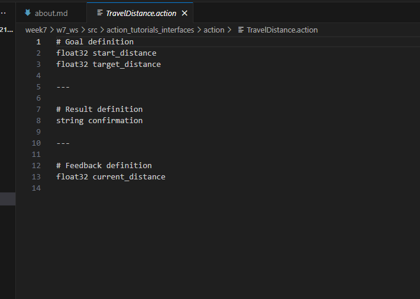
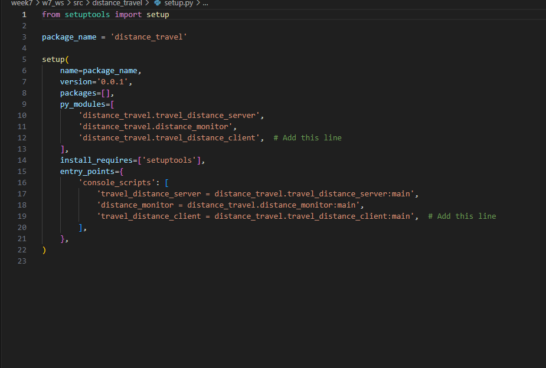
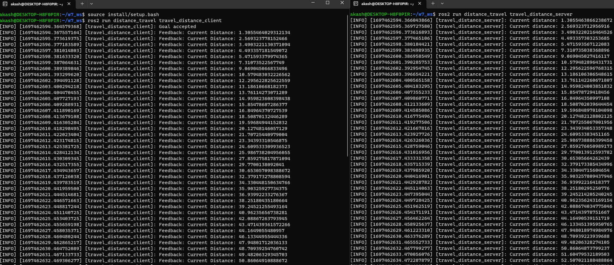
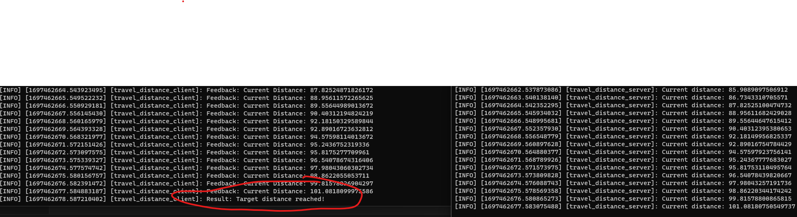

# Week 7: Creating Action Server and Action Client

In this week we were assigned to create action server and action client. And if possible, the project should be related to final project idea. For now we have some confusion to choose the topic yet. One of our idea involves the robot to follow a person on the gesture(Probably using Pose Estimation) or Voice Command. And to do so we will need the robot to stop at certain distance fom starting point. 

So, this week i create a ` ROS2 Distance Travel System`. 

# ` ROS2 Distance Travel System`
- Overview of the distance travel system.
- Role of ROS2 in automation and robotics.
- Purpose: Move a robot (or any entity) from one position to another based on a target distance.

## Interaction Diagram

<!-- I have used `'Overleaf'` to create this diagram. I have attached the snippet of it. 

 -->

```sql
+------------------------------------------------------------------------------+
|                                                                              |
|                        Travel Distance Action Server (Node)                  |
|                                                                              |
|          +---------------------------------------------------------+         |
|          |              Action Server (distance_travel)            |         |
|          |                                                         |         |
|          |  +------------------------+   +---------------------+   |         |
|          |  | Start & Target Distance |<->| Current Distance   |   |         |
|          |  +------------------------+   +---------------------+   |         |
|          +---------------------------------------------------------+         |
|                                     |                                        |
|                                     | Result (Confirmation of Distance)      |
|                                     V                                        |
+------------------------------------------------------------------------------+
                                      |
                                      |
                                      | Action Request, Feedback, and Result
                                      |
                                      |
                                      V
+------------------------------------------------------------------------------+
|                                                                              |
|                        Travel Distance Action Client (Node)                  |
|                                                                              |
|          +---------------------------------------------------------+         |
|          |              Action Client (distance_travel)            |         |
|          |                                                         |         |
|          |  +---------------------+   +--------------------+      |          |
|          |  | Set Distance Goal   |   | Feedback (Distance)|      |          |
|          |  +---------------------+   +--------------------+      |          |
|          +---------------------------------------------------------+         |
|                                     |                                        |
|                                     | Final Result (Confirmation Message)    |
|                                     V                                        |
+------------------------------------------------------------------------------+


```

You can find the original overleaf script under[Overleaf folder.](overleaf/)

## Actions in ROS2

**What are ROS2 Actions?**

- Actions provide a means of communication between nodes where one node requests a long-running task and receives - feedback and a result.
- Comprises three parts: Goal, Result, and Feedback.
- An action server provides a certain service, while a client sends goals and waits for results.


## The Client Node
**Understanding the Client Node**

- Initiates the action by sending a goal.
- In our context: Client sends the start and target distance.
- Waits for feedback and finally receives the result.
- Can cancel the action if needed.


## The Server Node: Dive into the Server Node


- Listens for goals from the client.
- Executes long-running tasks, in our case, simulates movement towards the target distance.
- Provides feedback (current distance) to the client.
- Once the task is complete, sends a result (confirmation of reaching the target).


## ROS2 Distance Travel System: Directory Structure

The structure of the ROS2 Distance Travel System is as follows:

### **action_tutorials_interfaces**
This package contains interfaces specifically for our action tutorial.

#### - **action**
   - **TravelDistance.action**: Defines the goal, result, and feedback structure for the `TravelDistance` action.

#### - **include**: Reserved for C++ header files (not used in this context).

#### - **src**: Contains the source files for the package (not shown in detail).

#### - **CMakeLists.txt**: Lists the CMake commands and system settings required for building the ROS package.

#### - **package.xml**: Provides metadata and dependencies for the ROS package.

### **distance_travel**
This is the main package for our distance travel application.

#### - **action**
   - **distance_travel**
      - **__init__.py**: Python package initializer.
      - **distance_monitor.py**: Node that subscribes to the current distance topic and logs it.
      - **travel_distance_client.py**: Client node responsible for sending the travel goal to the action server.
      - **travel_distance_server.py**: Server node that receives the goal, processes the movement, and sends feedback and results.

#### - **params**
   - **__init__.py**: Python package initializer.
   - **distance_parameters.yaml**: Contains parameters related to the distance travel, like target distance and thresholds.

#### - **resource**: Reserved for additional resources related to the package.

#### - **test**
   - **package.xml**: Metadata for testing the package.
   - **setup.cfg**: Configuration for setup tools.
   - **setup.py**: Python package setup script.

#### - **install**: Contains the installed files and executables post-build.

#### - **log**: Contains logs related to the execution and any issues.

---

## Code Snippet 

 # server


# Client

# Action File


# setup.py


# snippet of Result




