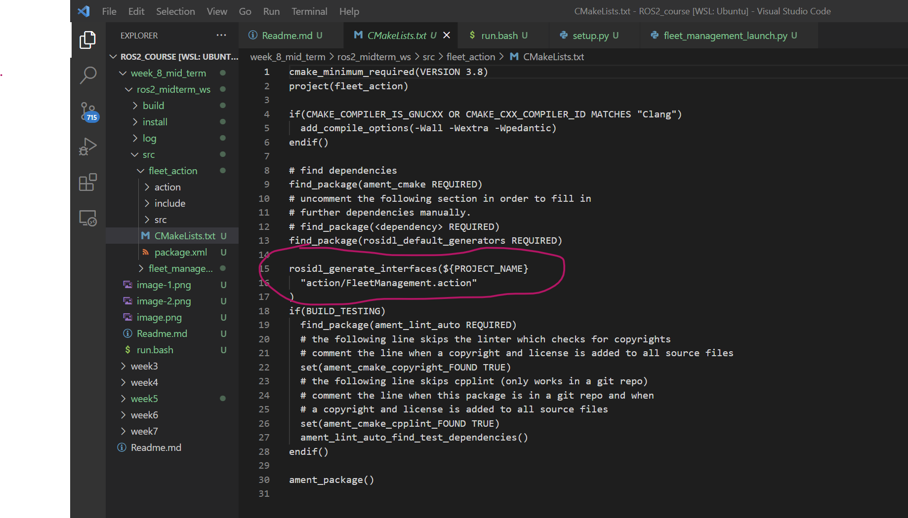
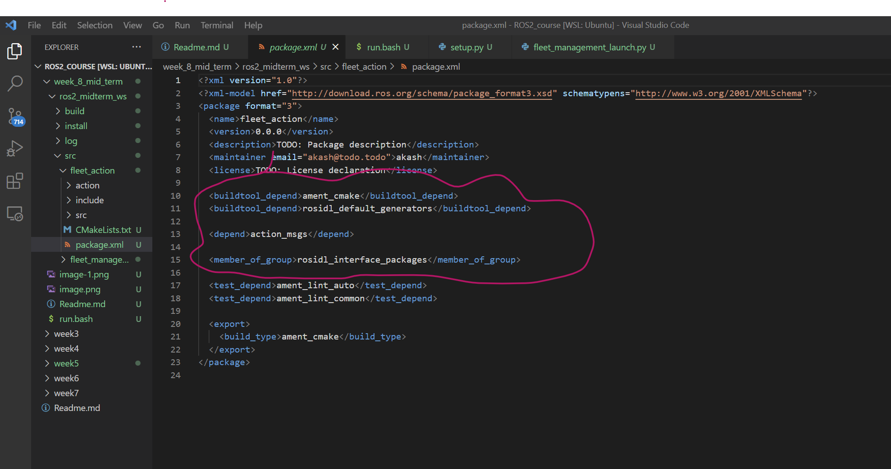
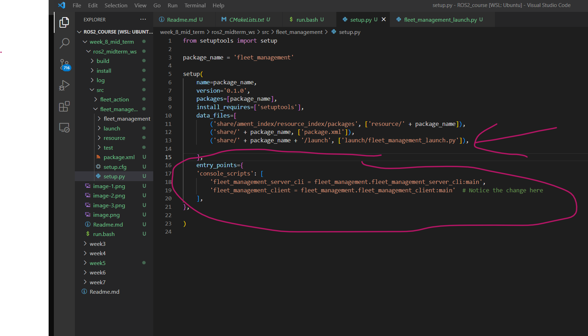
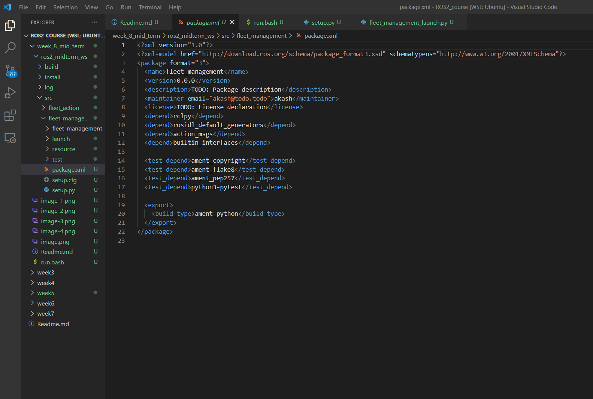
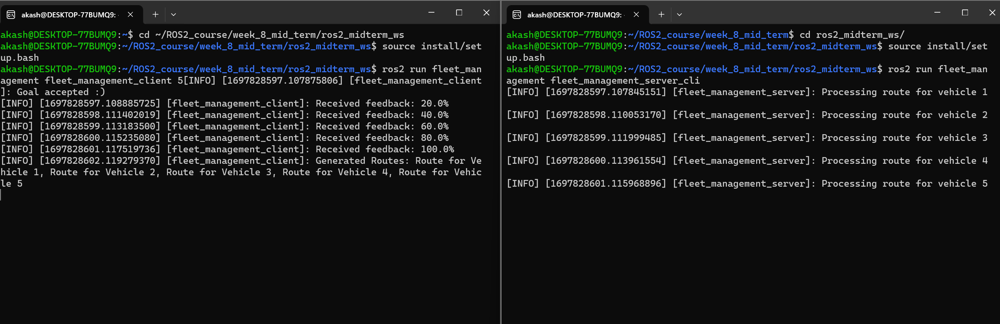
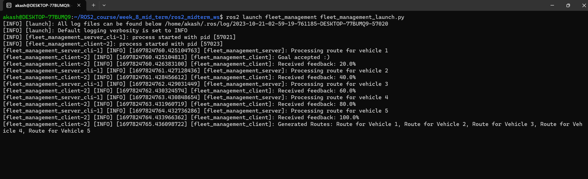
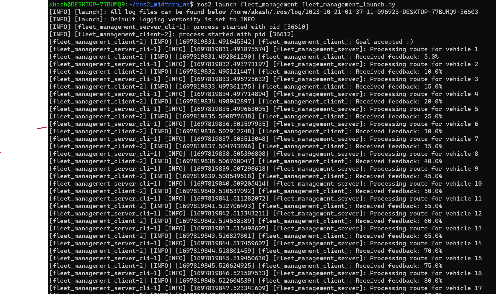
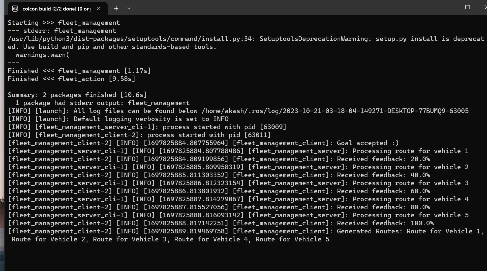

# ROS 2 Fleet Management Routing System

## Overview

This ROS 2 application simulates a fleet management routing system. The architecture revolves around a client-server model where the client represents individual vehicles (or fleet members) sending routing requests, and the server simulates the central control system determining the optimal route for each vehicle.

Our solution leverages the action interface in ROS 2 to manage the long-duration routing tasks. This allows for asynchronous communication between the fleet members (clients) and the central control (server), ensuring the system remains responsive to incoming routing requests even when processing previous ones.

## Why is this important?

In real-world scenarios, fleet management systems need to be efficient and responsive. They must quickly process routing requests to ensure the fleet's smooth operation, especially in dynamic environments. By simulating this in ROS 2, we gain insights into building scalable and effective routing solutions for actual fleets, whether they are taxis, drones, or delivery robots.

## Cleint-Server Overview


```sql
+------------------------------------------------------------------------------+
|                                                                               |
|                    Fleet Management Action Server (Node)                      |
|                                                                               |
|          +---------------------------------------------------------+          |
|          |            Action Server (fleet_management)             |          |
|          |                                                         |          |
|          |  +---------------------+   +------------------------+   |          |
|          |  | Fleet Size Request  |<->| Feedback (Processing %) |   |         |
|          |  +---------------------+   +------------------------+   |          |
|          +---------------------------------------------------------+          |
|                                     |                                         |
|                                     | Result (List of Generated Routes)       |
|                                     V                                         |
+------------------------------------------------------------------------------+
                                      |
                                      |
                                      | Action Request, Feedback, and Result
                                      |
                                      |
                                      V
+------------------------------------------------------------------------------+
|                                                                              |
|                              ROS 2 Network                                   |
|                                                                              |
+------------------------------------------------------------------------------+
                                      |
                                      |
                                      | Action Goal (Desired Fleet Size)
                                      | Feedback Callback
                                      | Result Callback
                                      |
                                      |
                                      V
+------------------------------------------------------------------------------+
|                                                                               |
|                    Fleet Management Action Client (Node)                      |
|                                                                               |
|          +---------------------------------------------------------+          |
|          |            Action Client (fleet_management)             |          |
|          |                                                         |          |
|          |  +------------------+   +-------------------------+     |          |
|          |  | Desired Fleet    |   | Received Feedback (in %)|     |          |
|          |  | Size (Goal)      |   +-------------------------+     |          |
|          |  +------------------+                                   |          |
|          +---------------------------------------------------------+          |
|                                     |                                         |
|                                     | Final Result (List of Routes)           |
|                                     V                                         |
+------------------------------------------------------------------------------+
                                      |
                                      |
                                      | Route Assignment and Execution
                                      |
                                      |
                                      V
+------------------------------------------------------------------------------+
|                                                                              |
|                           Actual Fleet of Vehicles                           |
|                   (Physical or Simulated Vehicles in Field)                  |
|                                                                              |
+------------------------------------------------------------------------------+

```


Here's a breakdown of the project's directory structure:

## Directory Structure

The [ros2_midterm_ws](ros2_midterm_ws/) have two packages: a) `fleet_action`, and b) `fleet_management`.  `fleet_action` package is used for defining action file : `FleetManagement.action`.  `fleet_management` is the *main* package of our workspace. This consist of `fleet_management_server_cli`,`fleet_management_client`, `launch files`.  

Here, we have explained the working directory in more detailed: 

### 1.  `action/`
Package for action definitions (from the `action_fleet` package).
- `FleetManagement.action`

### 2. `fleet_management/`

Main directory for the project.


#### `fleet_management/`
Python module for the package.
- `__init__.py`
- `fleet_management_server_cli.py`: The server script that simulates fleet routing
- `fleet_management_client.py`: The client script that sends routing requests and waits for results

#### `launch/`
Folder for launch files.
- `fleet_management_launch.py`: Launch file to start the server and client nodes

#### `package.xml`
Package description and dependencies.

#### `setup.py`
Setup file for Python package.

## 

## Code Explanation

### Fleet Management Server

The server part of the system is responsible for simulating the route processing of fleet vehicles. Let's break down the server code:

```python
import rclpy
import time
from rclpy.action import ActionServer
from rclpy.node import Node


from fleet_action.action import FleetManagement

class FleetManagementServer(Node):

    def __init__(self):
        super().__init__('fleet_management_server')
        self._action_server = ActionServer(
            self,
            FleetManagement,
            'fleet_management',
            self.execute_callback
        )

    def execute_callback(self, goal_handle):
        goal = goal_handle.request
        feedback_msg = FleetManagement.Feedback()
        result = FleetManagement.Result()

        for i in range(1, goal.fleet_size + 1):
            feedback_msg.completion_percentage = float(i) / float(goal.fleet_size) * 100.0
            self.get_logger().info(f'Processing route for vehicle {i}')
            goal_handle.publish_feedback(feedback_msg)
            result.routes.append(f'Route for Vehicle {i}')
            time.sleep(1.0)

        goal_handle.succeed()
        return result

def main(args=None):
    rclpy.init(args=args)
    fleet_management_server = FleetManagementServer()
    rclpy.spin(fleet_management_server)

if __name__ == '__main__':
    main()


```

#### Detailed Explanation 
```python
import rclpy
import time
from rclpy.action import ActionServer
from rclpy.node import Node


from fleet_action.action import FleetManagement

class FleetManagementServer(Node):

    def __init__(self):
        super().__init__('fleet_management_server')
        self._action_server = ActionServer(
            self,
            FleetManagement,
            'fleet_management',
            self.execute_callback
        )

```

- We begin by importing the necessary libraries. rclpy is the standard ROS 2 Python library, while time is used to introduce delays in the simulation.

- ActionServer is the ROS 2 utility to create an action server, and Node is a fundamental class for creating ROS nodes.

- FleetManagement is our custom action defined in the fleet_action package.


```python
def execute_callback(self, goal_handle):
        goal = goal_handle.request
        feedback_msg = FleetManagement.Feedback()
        result = FleetManagement.Result()

        for i in range(1, goal.fleet_size + 1):
            feedback_msg.completion_percentage = float(i) / float(goal.fleet_size) * 100.0
            self.get_logger().info(f'Processing route for vehicle {i}')
            goal_handle.publish_feedback(feedback_msg)
            result.routes.append(f'Route for Vehicle {i}')
            time.sleep(1.0)

        goal_handle.succeed()
        return result


```

- This is the main callback function that gets triggered when a client sends a goal to the server.
The function simulates route processing for each vehicle in the fleet.

- For each vehicle, it updates the feedback message's completion_percentage, logs a message indicating which vehicle's route is being processed, publishes this feedback to the client, and then appends a simulated route to the result.

- After all routes are processed, it marks the goal as succeeded and returns the result.


```python
def main(args=None):
    rclpy.init(args=args)
    fleet_management_server = FleetManagementServer()
    rclpy.spin(fleet_management_server)

if __name__ == '__main__':
    main()


```

- This is the main entry point for the server.

- It initializes the ROS system, creates an instance of our FleetManagementServer, and then enters a loop, listening for incoming action goals and processing them.


### Fleet Management Client

The client is responsible for sending a goal (which represents the desired number of fleet vehicles to process routes for) to the server. It then receives feedback and ultimately, the final routing results. Below is the breakdown of the client code:

```python
import sys
import rclpy
from rclpy.action import ActionClient
from rclpy.node import Node

from fleet_action.action import FleetManagement

class FleetManagementClient(Node):

    def __init__(self):
        super().__init__('fleet_management_client')
        self._client = ActionClient(self, FleetManagement, 'fleet_management')

    def send_goal(self, fleet_size):
        goal_msg = FleetManagement.Goal()
        goal_msg.fleet_size = fleet_size

        self._client.wait_for_server()

        self._send_goal_future = self._client.send_goal_async(
            goal_msg,
            feedback_callback=self.feedback_callback
        )

        self._send_goal_future.add_done_callback(self.goal_response_callback)

    def feedback_callback(self, feedback_msg):
        self.get_logger().info(f'Received feedback: {feedback_msg.feedback.completion_percentage}%')

    def goal_response_callback(self, future):
        goal_handle = future.result()
        if not goal_handle.accepted:
            self.get_logger().info('Goal rejected :(')
            return

        self.get_logger().info('Goal accepted :)')

        self._get_result_future = goal_handle.get_result_async()
        self._get_result_future.add_done_callback(self.get_result_callback)

    def get_result_callback(self, future):
        result = future.result().result
        self.get_logger().info(f'Generated Routes: {", ".join(result.routes)}')

def main(args=None):
    rclpy.init(args=args)
    fleet_management_client = FleetManagementClient()
    fleet_management_client.send_goal(int(sys.argv[1]) if len(sys.argv) > 1 else 5)
  # Default to 5 if no arg provided
    rclpy.spin(fleet_management_client)

if __name__ == '__main__':
    main()


```

#### Detailed Explanation 

```python
def main(args=None):
    rclpy.init(args=args)
    fleet_management_server = FleetManagementServer()
    rclpy.spin(fleet_management_server)

if __name__ == '__main__':
    main()


```

```python
class FleetManagementClient(Node):

    def __init__(self):
        super().__init__('fleet_management_client')
        self._client = ActionClient(self, FleetManagement, 'fleet_management')


```
- We define the FleetManagementClient class that inherits from the Node class.

- The client node is initialized with the name 'fleet_management_client'.

- An instance of the action client is created, which will communicate with the fleet_management action server.

```python
def send_goal(self, fleet_size):
        goal_msg = FleetManagement.Goal()
        goal_msg.fleet_size = fleet_size
        self._client.wait_for_server()


```

- The send_goal method is used to send the desired number of fleet vehicles (fleet size) to the server.

- A new goal message of type FleetManagement.Goal() is created, and the fleet_size passed to the method is set to the goal message.

```python
        self._send_goal_future = self._client.send_goal_async(
            goal_msg,
            feedback_callback=self.feedback_callback
        )
        self._send_goal_future.add_done_callback(self.goal_response_callback)


```
- We asynchronously send the goal to the server using send_goal_async. Additionally, we specify a feedback callback which will be triggered when the server sends feedback.

- A callback is also added to handle the server's response to our goal.

```python
def feedback_callback(self, feedback_msg):
        self.get_logger().info(f'Received feedback: {feedback_msg.feedback.completion_percentage}%')


```

- The feedback callback logs the feedback received from the server, which in our case is the completion percentage of fleet routing.

```python
def feedback_callback(self, feedback_msg):
        self.get_logger().info(f'Received feedback: {feedback_msg.feedback.completion_percentage}%')


```

```python
def goal_response_callback(self, future):
        goal_handle = future.result()
        if not goal_handle.accepted:
            self.get_logger().info('Goal rejected :(')
            return
        self.get_logger().info('Goal accepted :)')


```
- The callback for the goal's response. Here, we check if the goal was accepted by the server or not.

```python
        self._get_result_future = goal_handle.get_result_async()
        self._get_result_future.add_done_callback(self.get_result_callback)


```
- If the goal was accepted, we asynchronously request for the result and attach a callback that will handle this result once it's received.

```python
def get_result_callback(self, future):
        result = future.result().result
        self.get_logger().info(f'Generated Routes: {", ".join(result.routes)}')


```

- Once the result is received, this callback logs the generated routes for the fleet.


```python
def main(args=None):
    rclpy.init(args=args)
    fleet_management_client = FleetManagementClient()
    fleet_management_client.send_goal(int(sys.argv[1]) if len(sys.argv) > 1 else 5)  # Default to 5 if no arg provided
    rclpy.spin(fleet_management_client)


```

- The main function initializes the ROS system, creates an instance of the FleetManagementClient, sends a goal (with a default of 5 if no argument is provided), and then waits for feedback and results.


### `Launch File`

The launch file for the fleet management system is located at fleet_management/launch/fleet_management_launch.py.


```python
import launch
from launch_ros.actions import Node

def generate_launch_description():
    return launch.LaunchDescription([
        Node(
            package='fleet_management',
            executable='fleet_management_server_cli',
            name='fleet_management_server',
            output='screen'
        ),
        Node(
            package='fleet_management',
            executable='fleet_management_client',
            name='fleet_management_client',
            output='screen',
            arguments=['5']  # This represents the default fleet size to process. You can adjust as needed.
        )
    ])


```


### Breakdown of the Launch File

#### Importing the Necessary Modules:
- The `launch` module provides the foundational structures and classes needed to create a launch file.
- `from launch_ros.actions import Node` imports the `Node` action, which is a predefined action in the launch system to start ROS nodes.

#### Core Function: `generate_launch_description()`
- This function returns the launch configuration and is a necessary component of all ROS 2 launch files.
- Inside this function, a `launch.LaunchDescription` object is created, which can hold multiple actions (in this case, starting multiple nodes).

#### Adding Nodes to the Launch:
- Two `Node` actions are added to the `LaunchDescription`. One for the `fleet_management_server_cli` and one for the `fleet_management_client`.
  - **Parameters for the Node:**
    - `package`: Specifies the ROS 2 package where the executable resides.
    - `executable`: The name of the node executable.
    - `name`: A name for the node (this can be used for namespacing and remapping).
    - `output='screen'`: Directs the node's output to the terminal for debugging purposes.
    - `arguments`: A list of command-line arguments to be passed to the node upon startup. In this case, it's used to specify the fleet size for the client.


## Package Folder Changes Snippets

### 1. action_fleet `action file package`
> This package is created to store ``.action`` file. 

1. Update in `CMakeLists.txt`



## Update in `package.xml`


### 1. action_management `main package`

1. Update in `setup.py`



## Update in `package.xml`




## Snippet Result

### Running using `Node` only. 



### Using `Launch File` :  Small Fleet Size(5)




### Using `Launch File` :  Large Fleet Size (20)



## How to use run the code 

1. First change the directory to `week_8_mid_term`, then make the bash file executable

```bash
cd week_8_mid_term
chmod +x run.bash
```

The run the `run.bash` within this folder. This contain the following commands:
```bash
source /opt/ros/humble/setup.bash ## Enabling ros2 by sourcing it
sudo chmod +x -R ros2_midterm_ws/

cd /ros2_midterm_ws

colcon build ## to build it

source install/setup.bash

ros2 launch fleet_management fleet_management_launch.py

```
2. execute ``run.bash``

```bash
./run.bash
```

3. Snippet of building Package 



After executing the bash file, we can see the package was build and launch file was running with no problem.